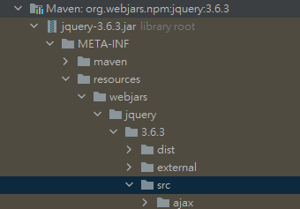
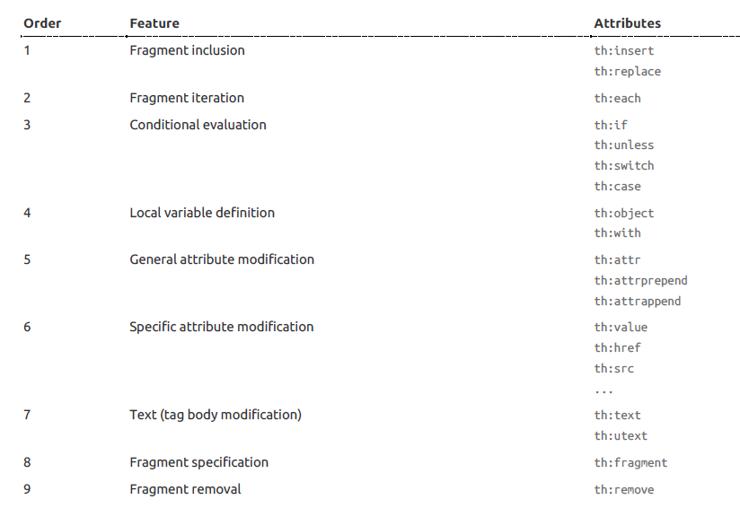
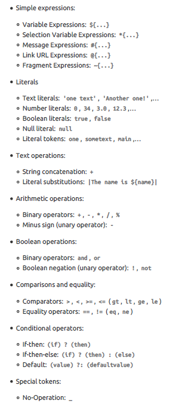
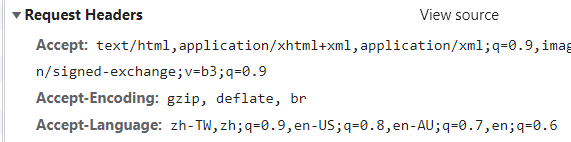

# Sprint Boot

## Spring Boot 標籤

### @SpringBootApplication 表示此類，是一個 Spring boot 應用

com.example.DemoApplication.java

```java

@SpringBootApplication
public class DemoApplication {

    public static void main(String[] args) {
        SpringApplication.run(DemoApplication.class, args);
    }

}
```

### @RestController 表示此類為，會回傳東西給瀏覽器的controller

com.example.controller.HelloController.java

```java

@RestController
public class HelloController {

    @RequestMapping("/hello")
    public String hello() {
        return "Hello";
    }

}
```

### @Component // 為 Spring boot 組件

### @Configuration // 配置類

### @ConfigurationProperties(prefix = "person") // 配置類，從 person 下取值

### @PropertySource(value = "classpath:person.properties") // 配置 profile 來源

```java
@Component
//@Configuration
@ConfigurationProperties(prefix = "person")
@PropertySource(value = "classpath:person.properties")
public class Person {
    //    @Value("${person.name}") // 不同的配置取值方式，搭配 @Configuration 申明為配置類
    private String name;
    //    @Value("#{10+5}")
    private Integer age;
    //    @Value("true")
    private Boolean isMale;
    ....
}
```

## application[.properties|.yml] 配置文檔

/src/resources/...

### 配置文檔模組

```text
建立一個配置模組文檔命名格式
application-{module}.properties
```

## 日誌工具 slf4j 與 logback

### Spring boot 預設使用: slf4j and logback 處理日誌
```text
slf4j: 日誌工具的 interface，類似於 JDBC
https://www.slf4j.org/legacy.html

logback: 日誌紀錄工具
```

### 日誌相關 application.properties 配置
```properties
# 指定日誌打印級別
#logging.level.com.example=trace
# (常用)指定日誌輸出的目錄(會在指定目錄下生成 spring.log)
logging.file.path=log
# 指定日誌輸出的文件
#logging.file.name=spring.log
# console 介面的日誌格式
logging.pattern.console=%d{yyyy-MM-dd} [%thread] %-5level %logger{50} - %msg%n
# log file 的日誌格式
#logging.pattern.file=%d{yyyy-MM-dd} [%thread] %-5level %logger{50} - %msg%n
```

### (延伸)自訂義 logback-spring.xml 配置
- path: src/main/resources/logback-spring.xml
```xml
<?xml version="1.0" encoding="UTF-8"?>
<configuration  scan="true" scanPeriod="60 seconds" debug="false">
    <!-- 應用名稱 -->
    <property name="APP_NAME" value="ApplicationName"/>
    <!-- Log 輸出根目錄 -->
    <property name="LOG_FILE_PATH" value="log"/>
    <!-- Log 輸出格式 -->
    <property name="PATTERN_FORMAT" value="%d{yyyy-MM-dd HH:mm:ss.SSS} %-5level %class{36} %L %M - %msg%xEx%n"/>
    <contextName>logback</contextName>
    <!-- 輸出到 Console -->
    <appender name="console" class="ch.qos.logback.core.ConsoleAppender">
        <encoder>
            <!-- 僅在 dev 環境下生效 -->
            <springProfile name="dev">
                <!-- log 輸出格式 -->
                <pattern>Dev ${PATTERN_FORMAT}</pattern>
            </springProfile>
            <!-- 僅在 prod 環境下生效 -->
            <springProfile name="prod">
                <!-- log 輸出格式 -->
                <pattern>Prod ${PATTERN_FORMAT}</pattern>
            </springProfile>
        </encoder>
    </appender>

    <!-- 輸出日誌檔案 -->
    <appender name="info" class="ch.qos.logback.core.rolling.RollingFileAppender">
        <!-- 日誌策略配置 -->
        <rollingPolicy class="ch.qos.logback.core.rolling.TimeBasedRollingPolicy">
            <!-- 在 log 目錄下，已日期為目錄生成日誌文件 -->
            <fileNamePattern>${LOG_FILE_PATH}/%d{yyyy-MM-dd,aux}/logback.info.%d{yyyy-MM-dd}.log</fileNamePattern>
        </rollingPolicy>
        <encoder>
            <!-- log 輸出格式 -->
            <pattern>%d{HH:mm:ss.SSS} %contextName [%thread] %-5level %logger{36} - %msg%n</pattern>
        </encoder>
        <!-- 只輸出定義級別 -->
        <!--        <filter class="ch.qos.logback.classic.filter.LevelFilter">-->
        <!--            <level>info</level>-->
        <!--            <onMatch>ACCEPT</onMatch>-->
        <!--            <onMismatch>DENY</onMismatch>-->
        <!--        </filter>-->
    </appender>

    <root level="info">
        <appender-ref ref="console" />
        <appender-ref ref="info" />
    </root>
</configuration>
```

## webjars 置入外部工具包

### webjars 包查詢網站

https://www.webjars.org/

### 在 Maven pom.xml 檔案中加入引入對應的包

```xml
<dependencies>
    <!-- 引入-jquery-from-webjars-->
    <dependency>
        <groupId>org.webjars.npm</groupId>
        <artifactId>jquery</artifactId>
        <version>3.6.3</version>
    </dependency>
</dependencies>
```

### 使用 api 索取包

http://localhost/webjars/jquery/...


## thymeleaf 模板工具

- path: src/main/java/com/example/demo/controller/HelloController.java
- view: src/main/resources/templates/thymeleaf.html

### 在 pom.xml 中引入 thymeleaf

[Spring Boot Doc: dev->build->starters](https://docs.spring.io/spring-boot/docs/current/reference/htmlsingle/#using.build-systems.starters
)

```xml
<dependencies>
    <!-- 引入-thymeleaf-from-spring-starters -->
    <dependency>
        <groupId>org.springframework.boot</groupId>
        <artifactId>spring-boot-starter-thymeleaf</artifactId>
    </dependency>
</dependencies>
```

### 預設編譯路徑

- spring thymeleaf 預設編譯 classpath:/templates 下的 html 文件

### 為 html 加入 thymeleaf 語法識別

```html
<!DOCTYPE html>
<html lang="en" xmlns:th="http://www.thymeleaf.org">
...
</html>
```

### 屬性



### 語句表達式



### 片段引用
```html
在要抽取的標籤上加入 th:fragment="templateName" 標籤
path: templates/dashboard.html
<header th:fragment="topbar"></header>

在其他頁面中使用
path: templates/emp/list.html
<div th:replace="~{dashboard::topbar}"></div>

也可透過類選擇器做引用
[(~{dashboard::#sidebarMenu})]
```
五不同的引用方法
- **th:insert**: 將片段插入聲明標籤內
- **th:replace**: 片段置換於聲明標籤
- **th:include**: 只抽取引用的內容，插入聲明標籤內
- **[[~{}]]**: *不進行*標籤轉譯引用
- **[(~{})]**: *進行*標籤轉譯引用

### Example

**在 Spring 中配置映射**

```java

@Controller
public class ThymeleafController {
    @RequestMapping("/thymeleaf")
    public String thymeleaf(Map<String, Object> map) {
        map.put("hiTag", "<h4>Hi</h4>");
        map.put("usernames", Arrays.asList("han", "jj", "mark"));
        map.put("author", new Object() {
            public String name = "ming";
            public Integer age = 20;
        });
        return "thymeleaf";
    }
}
```

**在頁面使用 thymeleaf 表達語句**

```html
<!DOCTYPE html>
<html lang="en" xmlns:th="http://www.thymeleaf.org">
<head>
    <meta charset="UTF-8">
    <title>Title</title>
</head>
<body>
<h1>Thymeleaf Tool</h1>
<hr/>

<h2>th:text and th:utext</h2>
<h3>th:text</h3>
<div id="def_id" class="def_cla" th:id="|${hiTag}_id|" th:class="|${hiTag}_cla|" th:text="${hiTag}">def_val</div>
<div>[[${hiTag}]]</div>

<h3>th:utext</h3>
<div th:utext="${hiTag}"></div>
<div>[(${hiTag})]</div>
<hr/>

<h2>th:each</h2>
<h3>被表記 th:each 的標籤也會被複製</h3>
<h4 th:each="name: ${usernames}">[[${name}]]</h4>
<h4>
    <span th:text="|${name}, |" th:each="name: ${usernames}"></span>
</h4>
<hr/>

<h2>th:object</h2>
<div th:object="${author}">
    <div>Author: [[*{name}]]</div>
    <div>Age: [[${author.age}]]</div>
</div>
<hr/>

<h2>@{}</h2>
<a href="thymeleaf" th:href="@{https://google.com}">google.com</a>

</body>
</html>
```

## MVC Config

- path: src/main/java/com/example/demo/config/MyMvcConfig.java
- view: src/main/resources/templates/mymvcconfig.html

### 添加 ViewController 配置

當訪問 /mymvcconfig 則會回傳 classpath:/templates/mymvcconfig.html

```java
//@EnableWebMvc // 完全掌握 Web Mvc 配置，取消所有 Spring 預設的配置
@Configuration
public class MyMvcConfig implements WebMvcConfigurer {

    @Override
    public void addViewControllers(ViewControllerRegistry registry) {
        registry.addViewController("/mymvcconfig").setViewName("mymvcconfig");
    }
}
```

## 國際化語言配置

### 在瀏覽器發送請求時 headers 中會帶有接受語言訊息



### 配置語言文檔

建立每個配置語言對應的文本

- path: src/main/resources/i18n/login**
- login.properties: 預設語言
- login_en_US.properties: 英語_美國
- login_zh_TW.properties: 中文_台灣

```properties
login.tip=請登入~
login.email=電子郵件~
login.password=密碼~
login.rememberme=記住我~
login.signin=登入~
```

### 將配置添加至 application.properties 中

指定國際化配置文件

- path: src/main/resources/application.properties
- language: src/main/resources/i18n/login**

```properties
spring.messages.basename=i18n.login
```

### 利用 thymeleaf 在 html 解析時使用對應的語言

*#{}* 會去讀取配置好的，語言文本

```html
<label for="floatingInput" th:text="#{login.email}">Email address</label>
```

### (延伸) 可自訂義 LocaleResolver 類，在請求中加入語言訊系來指定使用的語言

#### 自訂義 LocaleResolver 類

- path: src/main/java/com/example/demo/component/MyLocaleResolver.java
- 攜帶語言參數 http://localhost:8888/login?l=zh_TW

```java
public class MyLocaleResolver implements LocaleResolver {
    @Override
    public Locale resolveLocale(HttpServletRequest request) {
        String l = request.getParameter("l");
        Locale locale = Locale.getDefault();
        if (!StringUtils.isEmpty(l)) {
            String[] split = l.split("_");
            // Locale(語言, 區域);
            // Locale("en", "US");
            locale = new Locale(split[0], split[1]);
        }
        return locale;
    }

    @Override
    public void setLocale(HttpServletRequest request, HttpServletResponse response, Locale locale) {

    }
}
```

#### 在 MvcConfig 中使用自己的 LocaleResolver

- path: src/main/java/com/example/demo/config/MyMvcConfig.java

```java

@Configuration
public class MyMvcConfig implements WebMvcConfigurer {
    @Bean
    public LocaleResolver localeResolver() {
        return new MyLocaleResolver();
    }
}
```

## 地址重定向與內部轉發
### 地址重定向
Client 端地址會改變
```java
@Controller
public class Example{
    // 地址重定向至 /index
    @GetMapping("/redirect")
    public String redirect(){
        // 等價於原生寫法
        // response.sendRedirect("/index");
        return "redirect:/index";
    }
}
```

### 內部轉發
Server 內部自行處理，Client 端地址部不發生變化
```java
@Controller
public class Example{
    // 內部轉發至 /index
    @GetMapping("/forward")
    public String redirect(){
        // 等價於原生寫法
        // request.getRequestDispatcher("/index").forward(request, response);
        return "forward:/index";
    }
}
```

## RestfulCRUD

|         | RestfulCRUD   |  普通CRUD(URL來分區操作)  |
| --------   | -----  | ----  |
| 查詢      | emp--GET   |   getEmp     |
| 添加        |   emp--POST   |   addEmp?xxx   |
| 修改        |    emp/{id}--PUT    |  updateEmp?xxx  |
| 刪除        |    emp/{id}--DELETE    |  deleteEmp?xxx  |

### Spring Boot 中對應的映射標籤
- GetMapping("/xxx")
- PostMapping("/xxx")
- PutMapping("/xxx")
- DeleteMapping("/xxx")

### 使用 hiddenmethod 讓 spring boot 解析為對應請求

#### 在 application.properties 啟用 hiddenmethod 功能
```properties
# 啟用 hiddenmethod 過濾器功能
spring.mvc.hiddenmethod.filter.enabled=true
```

#### 在 from 表單中添加 _method 屬性(value 不區分大小寫)
```html
<form action="/emp" method="POST">
  <input type="hidden" name="_method" value="put">
    ....
</form>
```

#### 在 spring 設置路徑映射
```java
import com.example.demo.entities.Employee;

@Controller
public class EmployeeController {
    // 更新員工訊息
    @PutMapping("/emp")
    public String updateEmp(Employee employee) {
        ....
        return "redirect:/emps";
    }
}
```

## 錯誤處理與訂製錯誤頁面
### 訂製錯誤頁面
在靜態目錄在模板目錄下 error 目錄新增對應裝態的 .html 文件，在錯誤發生時就會顯示對應的錯誤頁面
- 無模板工具: src/main/resources/static/error/xxx.html
- 有模板： src/main/resources/{templates_base}/error/xxx.html
- 可用 4xx.html 與 5xx.html 頁面，來制定涵蓋所有 4 與 5 系列的錯誤響應頁面

### 錯誤頁面響應能獲取的訊息
使用 thymeleaf 模板工具能夠直接透過 **${status}** 拿出對應的錯誤訊息
- timestamp: 時間戳
- status: 狀態碼
- error: 錯誤提示
- exception: 異常對象
- message: 異常消息
- errors: JSR303數據檢驗的錯誤都在這裡

### 添加自定義的錯誤訊息
path: src/main/java/com/example/demo/exception
#### 建立 ExceptionHandler 類，管理錯誤拋出
```java
// 異常管理類
@ControllerAdvice
public class MyExceptionHandler {
    @ExceptionHandler(Exception.class) // 接收全部的 Exception
    // @ExceptionHandler(ServerException.class) // 接收特定的 Exception
    public String handlerException(Exception e, HttpServletRequest request){
        // 日誌紀錄
        Logger logger = LoggerFactory.getLogger(getClass());
        logger.error("My Exception Handler");

        // 在 AbstractErrorController 會取用 jakarta.servlet.error.status_code 來設定異常狀態訊息
        // path: spring-boot-autoconfigure-3.0.1.jar\org\springframework\boot\autoconfigure\web\servlet\error\AbstractErrorController.class
        // Integer statusCode = (Integer)request.getAttribute("jakarta.servlet.error.status_code");

        // 自訂義異常狀態碼
        request.setAttribute("jakarta.servlet.error.status_code", 500);

        // 建立自定義的異常數據集
        Map<String, Object> map = new HashMap<>();
        map.put("message", e.getMessage());
        map.put("exception", e);
        // 將自定義數據集，預先加入至 request 參數當中(會在 MyErrorAttributes 處理時邦定到，異常數據中)
        request.setAttribute("errors", map);

        // 委派給 Spring boot 預設的錯誤處裡類處裡(能夠自動適配請求 header 所需要的數據類型做響應)
        return "forward:/error";
    }
}
```

#### 建立 ErrorAttributes 類，管理錯誤信息回傳
```java
// 設置 Error 丟出時，附帶的錯誤信息
@Component
public class MyErrorAttributes extends DefaultErrorAttributes {
    @Override
    public Map<String, Object> getErrorAttributes(WebRequest webRequest, ErrorAttributeOptions options) {
        // 取得錯誤訊息數據
        Map<String, Object> errorAttributes = super.getErrorAttributes(webRequest, options);

        // 直接添加數據
        errorAttributes.put("company", "ming");

        // 間接添加數據，獲取先前添加好的數據，並添加到錯誤數據集中
        Map<String, Object> other = (Map<String, Object>) webRequest.getAttribute("errors", 0);
        errorAttributes.put("errors", other);

        // 回傳錯誤數據集
        return errorAttributes;
    }
}
```

## 註冊 Serverlet 三大組件
- 註冊 Servlet
- 註冊 Filter
- 註冊 Listener

### 註冊 Servlet
#### 1. 創建自定義 Servlet
- path: src/main/java/com/example/demo/servlet/MyServlet.java
```java
public class MyServlet extends HttpServlet {
    @Override
    protected void doGet(HttpServletRequest req, HttpServletResponse resp) throws ServletException, IOException {
        doPost(req, resp);
    }

    @Override
    protected void doPost(HttpServletRequest req, HttpServletResponse resp) throws ServletException, IOException {
        resp.getWriter().write("My Servlet...");
    }
}
```
#### 註冊至容器中
- path: src/main/java/com/example/demo/config/MyServerConfig.java
```java
@Configuration
public class MyServerConfig {
    // 註冊 Servlet
    @Bean
    public ServletRegistrationBean myServlet() {
        // 全地址使用 Servlet
        // ServletRegistrationBean<MyServlet> registrationServlet = new ServletRegistrationBean(new MyServlet());

        // 指定地址使用 Servlet
        ServletRegistrationBean<MyServlet> registrationServlet = new ServletRegistrationBean(new MyServlet());
        registrationServlet.setUrlMappings(Arrays.asList("/myservlet"));

        return registrationServlet;
    }
}
```

### 註冊 Filter
#### 1. 創建自定義 Filter
- path: src/main/java/com/example/demo/filter/MyFilter.java
```java
public class MyFilter implements Filter {
    @Override
    public void init(FilterConfig filterConfig) throws ServletException {
        Filter.super.init(filterConfig);
    }

    @Override
    public void doFilter(ServletRequest servletRequest, ServletResponse servletResponse, FilterChain filterChain) throws IOException, ServletException {
        System.out.println("My Filter...");
        // 放行通過
        filterChain.doFilter(servletRequest, servletResponse);
    }

    @Override
    public void destroy() {
        Filter.super.destroy();
    }
}
```
#### 註冊至容器中
- path: src/main/java/com/example/demo/config/MyServerConfig.java
```java
@Configuration
public class MyServerConfig {
    // 註冊 Filter
    @Bean
    public FilterRegistrationBean<MyFilter> myFilter() {
        // 全地址使用 Filter
        // FilterRegistrationBean<MyFilter> registrationFilter = new FilterRegistrationBean<>(new MyFilter());

        // 指定地址使用 Filter
        FilterRegistrationBean<MyFilter> registrationFilter = new FilterRegistrationBean<>(new MyFilter());
        registrationFilter.setUrlPatterns(Arrays.asList("/myfilter"));

        return registrationFilter;
    }
}
```

### 註冊 Listener
#### 1. 創建自定義 Listener
- path: src/main/java/com/example/demo/listener/MyListener.java
```java
public class MyListener implements ServletContextListener {
    @Override
    public void contextInitialized(ServletContextEvent sce) {
        System.out.println("Web 應用啟動...");
    }

    @Override
    public void contextDestroyed(ServletContextEvent sce) {
        System.out.println("Web 應用關閉...");
    }
}
```
#### 註冊至容器中
- path: src/main/java/com/example/demo/config/MyServerConfig.java
```java
@Configuration
public class MyServerConfig {
    // 註冊 Listener
    @Bean
    public ServletListenerRegistrationBean myListener(){
        ServletListenerRegistrationBean<MyListener> registrationListener = new ServletListenerRegistrationBean<>(new MyListener());
        return registrationListener;
    }
}
```

## 使用其他 Servlet 容器
- tomcat(預設)
- jetty(長連接優勢)
- undertow(多執行續優勢)

### 修改配置方法，以 Maven 為例
- path: pom.xml
```xml
<!-- 使用其他 Servlet 容器-->
<project>
    <dependency>
        <groupId>org.springframework.boot</groupId>
        <artifactId>spring-boot-starter-web</artifactId>
        <!-- 註銷預設使用的 tomcat -->
        <exclusions>
            <exclusion>
                <groupId>org.springframework.boot</groupId>
                <artifactId>spring-boot-starter-tomcat</artifactId>
            </exclusion>
        </exclusions>
    </dependency>
    <dependency>
        <groupId>org.springframework.boot</groupId>
        <!-- 使用 undertow -->
        <artifactId>spring-boot-starter-undertow</artifactId>
        <!-- 使用 jetty -->
        <!-- <artifactId>spring-boot-starter-jetty</artifactId> error-->
    </dependency>
</project>
```
