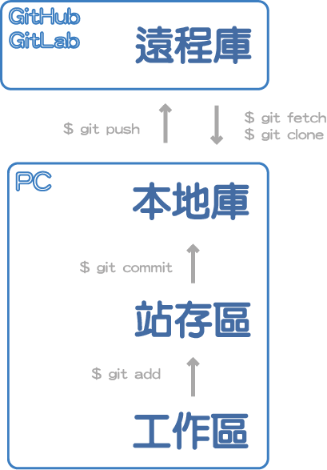

## Git And GitHub

### git開法模式

### git架構

### 創建git管理
    $ git init

### 建立簽名
    作用:
        區分開發人員的身分
    命令:
        項目/倉庫級別: 僅在本地庫範圍有效
            $ git config user.name chia_ming
            $ git config user.email chia_ming@gmail.com
        系統用戶級別: 登入當前作業系統的用戶範圍
            $ git config --global user.name chia_ming
            $ git config --global user.email chia_ming@gmail.com
    優先級別:
        就近原則: 項目級別優先於系統用戶級別
        兩者都沒有是不容許的

### git狀態查看
    $ git status

### git歷史版本
    1. 版本查看
        $ git reflog

    2. 版本切換
        $ git reset --hard [版本碼]

### git添加監控(git add)
    1. 全部添加
        $ git add .

    2. 指定文件添加
        $ git add [文件名]

### git提交(git commit)
    1. 全部提交
        $ git commit -a -m "日誌訊息"

    2. 指定文件提交
        $ git commit -m "日誌訊息" [文件名]

### 文件的比較
    1. 將工作區文件與暫存區文件進行比較
        $ git diff [文件名]

    2. 將工作區中的文件和本地庫歷史紀錄比較
        $ git diff [本地庫歷史版本] [文件名]

    3. 不帶文件名比較多個文件
        $ git diff 【本地庫歷史版本】
        
### git分支
    1. 查看分支
        $ git branch -v

    2. 建立分支
        $ git branch [分支名]

    3. 刪除分之
        $ git branch [分支名] -d

    4. 切換分支
        $ git checkout [分支名]

    5. 合併分支
        第一步: 切換到接受修改的分支((主分支)被合併，增加新內容)
            $ git checkout [(主分支)被合併的分支]

        第二步: 執行 merge 命令
            $ git merge [(外分支)有新內容的分支名]

    6. 衝突解決
        第一步: 編輯文件，刪除特殊符號
        第二步: 把文件修改到滿意的程度，保存退出
        第三步: $ git add [文件名]
        第四步: $ git commit -m "日誌訊息"
            * 注意: 此時 commit 一定不能帶具體文件名

## 刪除遠程庫分支
    無法刪除遠程庫默認分支
        使用 --delete 
            簡寫 -d

        刪除單個分支
        $ git push [remote] --delete [remote_branch_name]
            ex. git push origin --delete dev
        
        刪除多個分支
        $ git push [remote] -d [remote_branch_name1] [remote_branch_name2]
            ex. git push origin -d feature master

## 分支合併
    正常合併
    # keep both files
    git merge [branch_name]

    有衝突已本地庫為主
    # keep local files
    git merge [remote_branch_name] -X theirs
        ex. git merge origin/master -X theirs

    完全以本地庫目前檔案為主
    # 可以直接 push
    git merge [remote_branch_name] -s ours
    git merge origin/master -s ours

    完全已遠程庫為主
    git reset --hart origin/master
    

## GitHub演示

### 建立遠程庫地址別名
    1. 查看遠程庫地址別名
        $ git remote -v

    2. 添加遠程庫地址別名
        $ git remote add [別名] [遠程庫地址]
            ex. $ git remote add origin https://github.com/alsk1369854/FunctionCaller.git

### SSH登入(無須重複登入)
    1. 進入當前用戶的家目錄
        $ cd ~

    2. 刪除 .ssh 目錄
        $ rm -rvf .ssh

    3. 運行命令生成 .ssh 密鑰目錄
        $ ssh-keygen -t rsa -C alsk1369854@gmail.com
        [注意: 這裡 -C 這個參數是大寫 C]

    4. 進入 .ssh 目錄查看文件列表
        $ cd .ssh
        $ ls -lF

    5. 查看 id_rsa.pub 文件內容
        $ cat id_rsa.pub

    6. 複製 id_rsa.pub 文件內容
    
	7. 登入GitHub，點擊用戶頭像 => Setting => SSH and GPG Keys => New SSH key
    	輸入複製的密鑰訊息

    8. 回到 Git bash 創建SSH遠程地址別名
        git remote add origin_ssh git@github.com:alsk1369854/FunctionCaller.git

    9. 推送文件進行測試

### 推送操作
    $ git push [遠程庫別名] [本地庫分支]
        ex. $ git push origin master

### 克隆操作
    $ git clone [遠程庫地址]
        ex. $ git clone https://github.com/alsk1369854/FunctionCaller.git

### 拉取操作
    1. 拉取遠程庫
        $ git fetch [遠程庫地址別名] [遠程庫分支]
        使用 $ git checkout [遠程庫地址別名/遠程庫分支]
            進入查看檢查文件，沒問題後進行 merge
            可使用 $ git diff [版本] 【文件名稱】 查看文件變化
    
    2. 合併本地庫
        $ git merge [遠程庫地址別名/遠程庫分支]