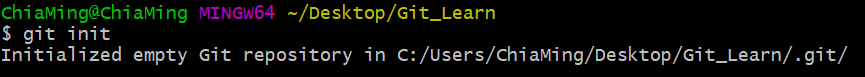
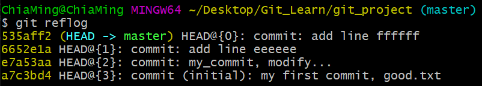
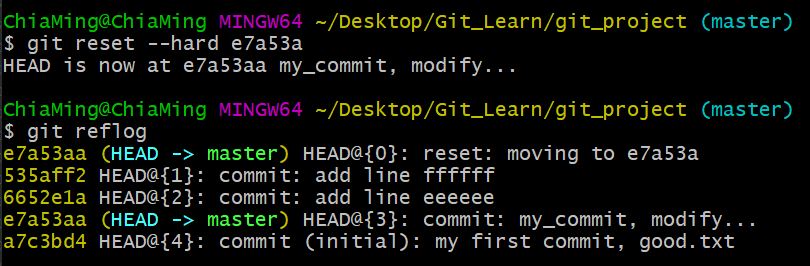

## Git基本操做

### 建立包管理
    $ git init 
        建立包管理

    $ ll 
        列出所由檔案
    $ ll -lA 
        列出所有檔案(包含隱藏檔案) .開頭文件為隱藏檔案

### 建立簽名
    作用:
        區分開發人員的身分
    命令:
        項目/倉庫級別: 僅在本地庫範圍有效
            $ git config user.name chia_ming
            $ git config user.email chia_ming@gmail.com
        系統用戶級別: 登入當前作業系統的用戶範圍
            $ git config --global user.name chia_ming
            $ git config --global user.email chia_ming@gmail.com
    優先級別:
        就近原則: 項目級別優先於系統用戶級別
        兩者都沒有是不容許的

    // 項目/倉庫級別: 僅在本地庫範圍有效

    
    // 系統用戶級別: 登入當前作業系統的用戶範圍

### vim 編輯器 / 文本處理
    命令
    $ vim good.txt
        // 創建/編輯 文件
        按下 "i" 進入編輯模式
        按下 "ESC" 進入指令模式
        $ :set nu 
            顯示行號
        $ :wq  
            保存退出
        $ :q!
            不保存退出
    $ cat good.txt
        // 顯示文件內容
    $ mkdir dir_name
        // 新建一個文件夾
    $ tail -n 3 good.txt
        // 顯示文件內容倒數3行
    $ rm goot.txt
        // 刪除指定文件
    $ mv goot.txt /target_dir
        // 搬移文件
    $ ping www.google.com -c 3
        // 發送網路封包
    $ service network restart
        // 重啟網路
    $ ifconfig
        // 查看IP地址
    $ service firewall stop
        // 關閉防火牆

    建立一個文件/ 開啟文件對其進行編輯
    $ vim good.txt
    按下 "i" 進入編輯模式
    按下 "ESC" 進入指令模式
    $ :set nu 
        顯示行號
    $ :wq  
        保存退出
    $ :!q
        不保存退出
    

    
    $ cat file_name
    查看文件內容

### git 狀態查看
    $ git status
        查看git狀態
    $ git add good.txt
        對文件做追蹤
    $ git rm --cached good.txt
        撤銷對文件的追蹤
    $ git commit good.txt
        提交文件 => 會跳入 vim 編寫提交說明
    $ git commit -m "My_commit, modify ..." good.txt
        提交文件 => -m "" 內直接寫提交說明，不會進入 vim 編輯介面

    // 初始化狀態

    
    // 有文件未被追蹤

    
    // 有文件被追蹤，可進行提交或撤銷追中

    
    // 提交完成

    // 發現追中文件有變化

    // 直接再次提交

### 查看版本狀態
    // (HEAD -> master) => 代表當前版本

    $ git log
        詳細展開
        若紀錄超出頁面顯示範圍
        : "空白鍵"
            可切換下一頁
        : "b"
            向上翻頁
        : "q"
            退出
    
    $ git log --pretty=oneline
        顯示單行展示版本

    $ git --oneline
        顯示簡易版本

    $ git reflog
        顯示簡易版本且 HEAD@{移動到此版本需要的步數}
    

### 歷史版本前進/後退
    // 跳轉[推薦]
    $ git reset --hard [版本碼]
    $ git reset --hard e7a53aa
    
    $ git reset --hard HEAD
        // 同步恢復當前指針指向狀態

    // 只能往後退[不推薦]
    $ git reset --hard HEAD^
    // 後退三次
    $ git reset --hard HEAD^^^
    // 多次後退簡寫
    $ git reset --hard HEAD~3

    // reset 三個命令比對
    --soft
        僅在本地庫移動 HEAD 指針
    --mixed 
        在本地庫移動 HEAD 指針
        重置了暫存區
    --hard
        在本地庫移動 HEAD 指針
        重置了暫存區
        重置了工作區
    
    // 跳轉前

    // 使用跳轉與顯示

### 比較文件
    $ git diff [file_name]
        

