## 4.3 基本操作
### 建立包管理
    $ git init 
        建立包管理
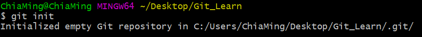
    
### 建立簽名
    作用:
        區分開發人員的身分
    命令:
        項目/倉庫級別: 僅在本地庫範圍有效
            $ git config user.name chia_ming
            $ git config user.email chia_ming@gmail.com
        系統用戶級別: 登入當前作業系統的用戶範圍
            $ git config --global user.name chia_ming
            $ git config --global user.email chia_ming@gmail.com
    優先級別:
        就近原則: 項目級別優先於系統用戶級別
        兩者都沒有是不容許的

### 4.3.1 狀態查看操作
    $ git status
    查看工作區、暫存區狀態

### 4.3.2 添加操作
    $ git add [文件名]
        將工作區的 "新建/修改" 添加到暫存區
    $ git add .
        獎全部的文件加入追蹤

### 4.3.3 提交
    $ git commit -m "commit message" [file name]
    將暫存區的內容提交到本地庫

### 4.3.4 查看歷史紀錄
    // (HEAD -> master) => 代表當前版本
    $ git log
        詳細展開
        若紀錄超出頁面顯示範圍
        : "空白鍵"
            可切換下一頁
        : "b"
            向上翻頁
        : "q"
            退出
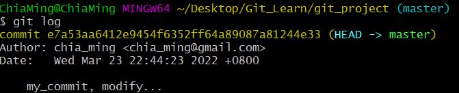
    
    $ git log --pretty=oneline
        顯示單行展示版本
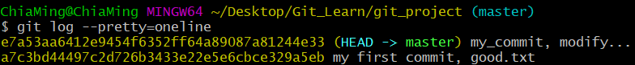

    $ git --oneline
        顯示簡易版本
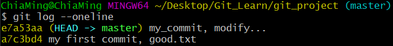

    $ git reflog
        顯示簡易版本且 HEAD@{移動到此版本需要的步數}
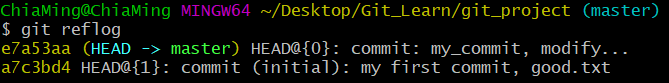

### 4.3.5 歷史版本前進/後退
    // 跳轉[推薦]
    $ git reset --hard [版本碼]
    $ git reset --hard e7a53aa
    
    $ git reset --hard HEAD
        // 同步恢復當前指針指向狀態

    // 只能往後退[不推薦]
    $ git reset --hard HEAD^
    // 後退三次
    $ git reset --hard HEAD^^^
    // 多次後退簡寫
    $ git reset --hard HEAD~3

    // 跳轉前
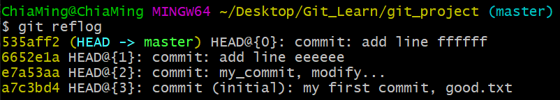

    // 使用跳轉與顯示
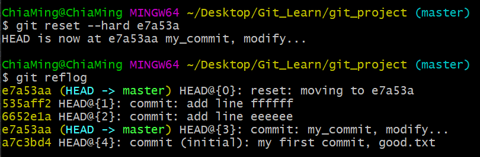

### 4.3.6 reset 命令比對
    --soft
        僅在本地庫移動 HEAD 指針
    --mixed 
        在本地庫移動 HEAD 指針
        重置了暫存區
    --hard
        在本地庫移動 HEAD 指針
        重置了暫存區
        重置了工作區

### 4.3.7 刪除文件並找回
    前提: 刪除前，文件存在時的狀態提交到了本地庫
    操作: $ git reset --hard [指針位置]
        刪除操作已經提交到了本地庫: 指針位置指向歷史紀錄
        刪除操作尚未提交到本地庫: 指針位置使用 HEAD

### 4.3.8 比較文件差異
    $ git diff [文件名]
        將工作區文件與暫存區文件進行比較
    $ git diff [本地庫歷史版本] [文件名]
        將工作區中的文件和本地庫歷史紀錄比較
    $ git diff 【本地庫歷史版本】
        不帶文件名比較多個文件

## 4.4分支管理
### 4.4.1 什麼是分支管理?
    在版本控制過程中，使用多條同時推移多個任務
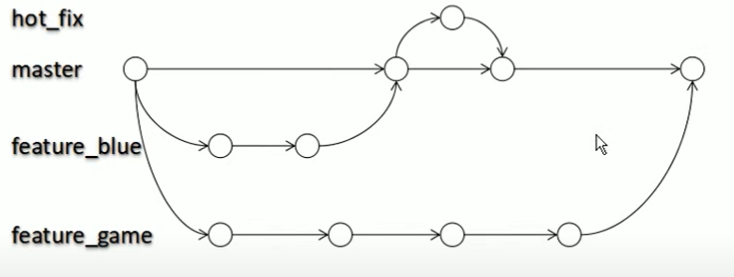

### 4.4.2 分支的好處?

### 4.4.3 分支操作
    1. 同時並行多個功能開發，提高開發效率
    2. 各分支在開發過程中，如果某一個分支開發失敗，不會對其他分支有任何影響，
        失敗的分支刪除重新開始即可。

### 4.4.4 分支操作
    1. 創建分支
        $ git branch [分支名]
        
        刪除分支
        $ git branch [分支名] -d
            
    2. 查看分支
        $ git branch -v
    3. 切換分支
        $ git checkout [分支名]
    4. 合併分支
        第一步: 切換到接受修改的分支((主分支)被合併，增加新內容)
            $ git checkout [(主分支)被合併的分支]
        第二步: 執行 merge 命令
            $ git merge [(外分支)有新內容的分支名]
    5. 解決衝突
        衝突的表現
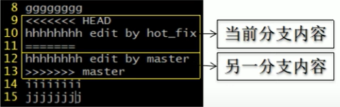
        
        衝突的解決
            第一步: 編輯文件，刪除特殊符號
            第二步: 把文件修改到滿意的程度，保存退出
            第三步: $ git add [文件名]
            第四步: $ git commit -m "日誌訊息"
                * 注意: 此時 commit  一定不能帶具體文件名

## 5 Git 的基本原理
### 5.1 哈希
    哈希是一個系列的加密算法，各個不同的哈希算法雖然加密強度不同，但是他有以下幾個共通點:
        1. 不管輸入數據的數量有多大，輸入同一個哈希算法，得到的加密解果長度固定。
        2. 哈希算法確定，輸入數據確定，輸出數據能夠保證不變。
        3. 哈希算法確定，輸入數據有變化，輸出數據一定有變化，而且通常變化很大
        4. 哈希算法不可逆
    Git 底層採用的是 SHA-1 算法
    哈希算法可以被用來驗證文件，原理如下圖所示:
    Git 就是靠這種機制來從根本上保證數據的完整性。

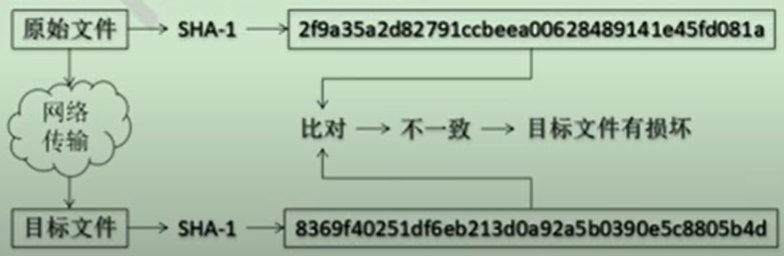

## 6 GitHub
### 6.2 創建遠程庫
    1. 創建遠程庫
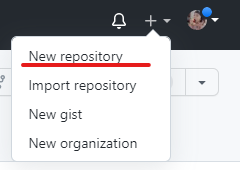
    
    2 . 獲得遠程庫地址 
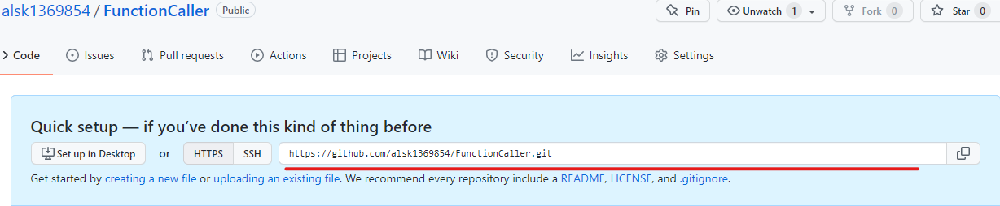
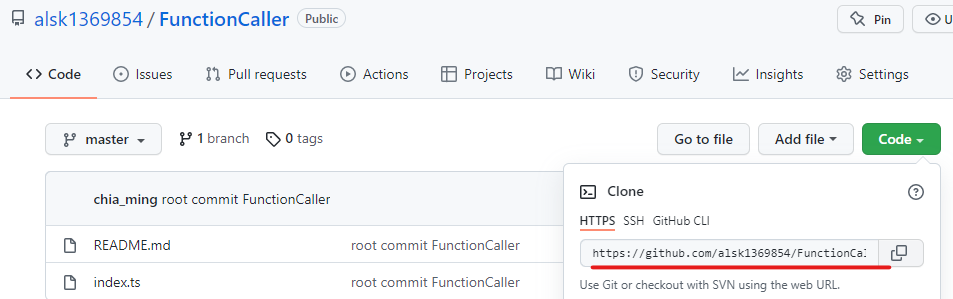

### 6.3 建立遠程庫地址別名
    $ git remote -v
    查詢遠程庫地址別名
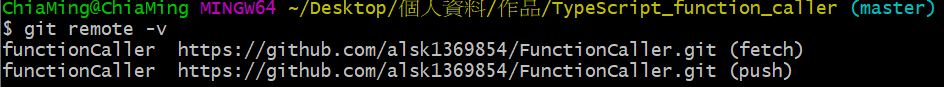

    $ git remote add [別名] [遠程庫地址]
    $ git remote add functionCaller https://github.com/alsk1369854/FunctionCaller.git
    把遠程庫地址添加別名
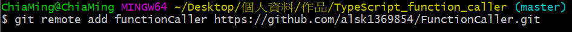

### 6.4 推送操作
    $ git push [遠程庫別名] [本地庫分支]
    $ git push functionCaller master
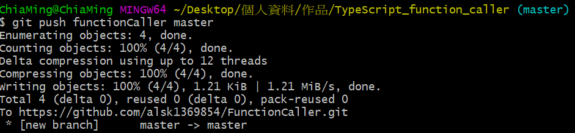

### 6.5 克隆操作
    命令
    $ git clone [遠程庫地址]
    $ git clone https://github.com/alsk1369854/FunctionCaller.git
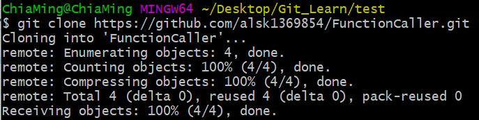

    效果
        1. 完整把遠程庫下載到本地
        2. 創建 origin 遠程庫地址別名
        3. 初始化本地庫
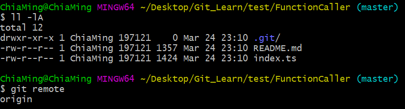

    Windows 認證問題
        按下圖找出認證刪除即可登入其他帳號進行提交:
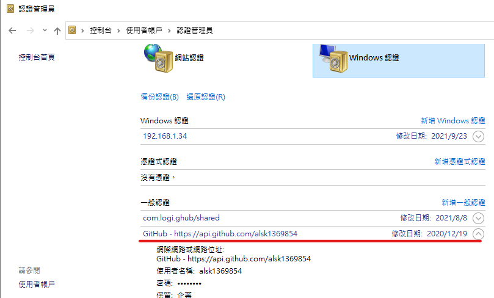

### 6.6 團隊成員邀請
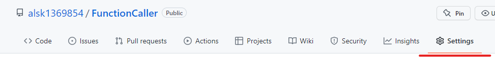
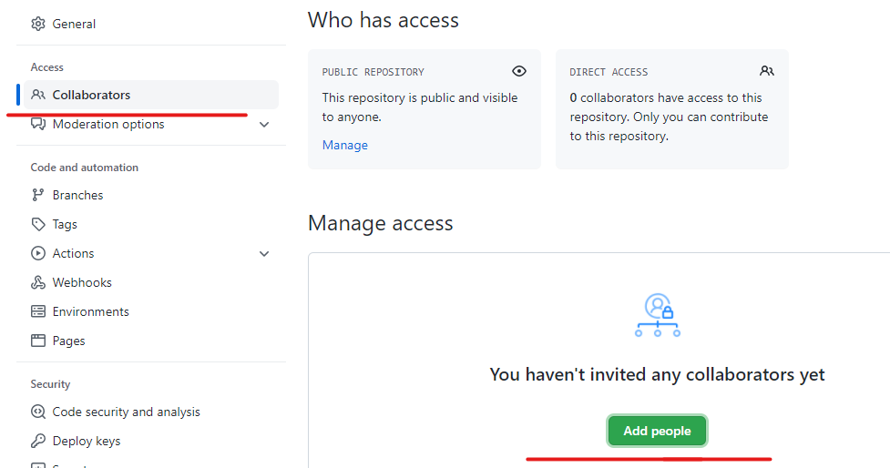
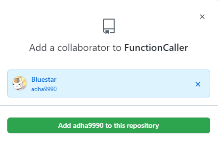
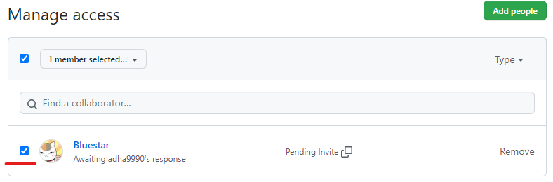

### 6.7 拉取
    pull = fetch + merge
    $ git fetch [遠程庫地址別名] [遠程庫分支]
    使用 $ git checkout [遠程庫地址別名/遠程庫分支]
        進入查看檢查文件，沒問題後進行 merge
        可使用 $ git diff [版本] 【文件名稱】 查看文件變化
    $ git merge [遠程庫地址別名/遠程庫分支]

    所做修改比較簡單，不會產生衝突可直接使用pull
    $ git pull [遠程庫地址別名] [遠程庫分支]

### 6.8 解決衝突
    要點 
        如果不是基於 GitHub 遠程庫的最新版本所做的修改，不能推送，必須先拉取。
        拉取下來後如果進入衝突狀太，則按照 "分支衝突解決" 操作解決即可
    類比
        債權人: 老王
        債務人: 小劉
        
        星期一 老王說: 10天後歸還。    小劉接受了，雙方達成一致。
        星期二 老王太太說: 5天後歸還。  小劉不能接受。老王太太需要找老王確認後在執行。

### 6.10 SSH登入(無須重複登入)
    進入當前用戶的家目錄
        $ cd ~
    刪除 .ssh 目錄
        $ rm -rvf .ssh
    運行命令生成 .ssh 密鑰目錄
        $ ssh-keygen -t rsa -C alsk1369854@gmail.com
        [注意: 這裡 -C 這個參數是大寫 C]
    進入 .ssh 目錄查看文件列表
        $ cd .ssh
        $ ls -lF
    查看 id_rsa.pub 文件內容
        $ cat id_rsa.pub
    複製 id_rsa.pub 文件內容，登入GitHub，點擊用戶頭像 -> Setting -> SSH and GPG Keys
        New SSH key
    輸入複製的密鑰訊息
    回到 Git bash 創建SSH遠程地址別名
        git remote add origin_ssh git@github.com:alsk1369854/FunctionCaller.git
    推送文件進行測試

### Git 開法流程
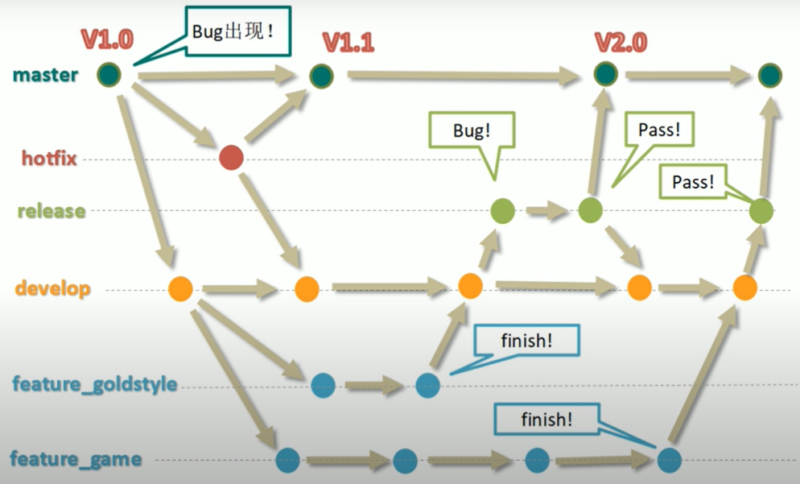

## GitLib
    將遠程庫架設在一台區網內的Linux系統上
    
### 9.4 GitLab 服務操作
    初始化配置GitLab
        $ gitlab-ctl reconfigure
    啟動 GitLab 服務
        $ gitlab-ctl start
    停止 GitLab 服務
        $ gitlab-ctl stop