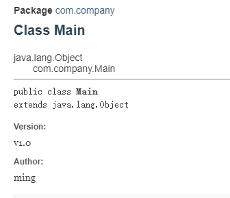

## 一.文本注解
    1. 在 /**  */ 內部撰寫說明內容
    2. 生成說明文件指令
        $ javadoc -d myMain -author -version .\Main.java
    使用案例代碼:
        /**
        * @auther ming
        * @version v1.0
        */
        public class Main {
            /**
            * Program entry point
            */
            public static void main(String[] args){
                System.out.println("Hello World!");        
            }
        }

## 二. 不同進制表示法
    二進制(binary): 以0b或0B開頭, int binary = 0b1001
    十進制(): int decimal = 123
    八進制(): 以數字0開頭, int octal = 075
    十六進制(): 以0x或0X開頭, int hex = 0xAF12
