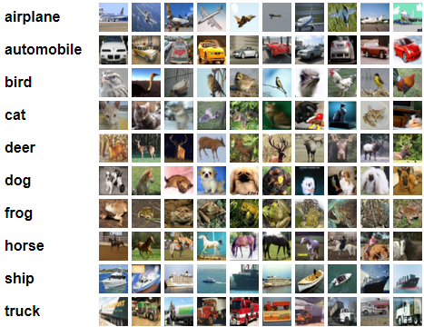

# Tensorflow
- 1. Tensor 類型
- 2. Tensor 創建
- 3. Tensor 索引與切片
- 4. Tensor 維度變換
- 5. Tensor 廣展
- 6. Tensor 數學運算
- 7. 實作 向前傳播(Forward): 修正 loss 最佳化預測解果 
- 8. Tensor 分割與合併
- 9. 數據統計
- 10. Tensor 排序
- 11. 實作 計算前 Top k 的預測結果準確率
- 12. Tensor 填充與複製
- 13. Tensor 限幅
- 14. 高階操作 根據座標(取值|更新值|生成座標點)
- 15. 數據加載
- 16. 實作 模型測試
- 17. 全連接層
- 18. 
  

## 1. Tensor 類型
- 1-1. Tensor 支持的類型
- 1-2. Tensor 使用 cpu/gpu 的資源
- 1-3. Tensor to Numpy
- 1-4. Tensor 維度訊息
- 1-5. Tensor 數據類型轉換
- 1-6. Variable 可訓練的 Tensor
- 1-7. 判斷是否為 Tensor or Variable 物件

### 1-1. Tensor 支持的類型
- int, float, double
- bool
- string

Tensor 在創建類型時會自動識別數據類型，若要指定類型的話就需給定 'dtype' 參數
- int:   dtype=tf.int8 | int16 | int32 | int64 
- float: dtype=tf.float16 | float32 | float64 | double
- bool:  dtype=tf.bool
- string:dtype=tf.string
```python
# int 自動辨識類型
t_int = tf.convert_to_tensor(1)
print(t_int)
# tf.Tensor(1, shape=(), dtype=int32)

# float 自動辨識類型
t_float = tf.convert_to_tensor(1.)
print(t_float)
# tf.Tensor(1.0, shape=(), dtype=float32)

# 指定類型為 double 
t_double = tf.convert_to_tensor(1, dtype=tf.double) 
print(t_double)
# tf.Tensor(1.0, shape=(), dtype=float64)
```

### 1-2. Tensor 使用 cpu/gpu 的資源
cpu 與 gpu 資源不能互通，只能訪問到同資源底下的資料
```python
# Tensor 使用 cpu 或 gpu 資源
with tf.device('cpu'):
    t_cpu = tf.convert_to_tensor(1.)
with tf.device('gpu'):
    t_gpu = tf.convert_to_tensor(2.)

print(t_cpu.device)
# /job:localhost/replica:0/task:0/device:CPU:0
print(t_gpu.device)
# /job:localhost/replica:0/task:0/device:GPU:0
```

### 1-3. Tensor to Numpy
```python
# Tensor to Numpy
data = tf.range(5)
print(data)
# tf.Tensor([0 1 2 3 4], shape=(5,), dtype=int32)

result = data.numpy()
print(result)
# [0 1 2 3 4]

data = tf.ones([]) 
# tf.Tensor(1.0, shape=(), dtype=float32)
print(data.numpy()) # 1.0
print(int(data)) # 1
print(float(data)) # 1.0
```

### 1-4. Tensor 維度訊息
- .ndim : 獲取維度
- .shape : 獲取維度結構
- .dtype : 獲取 tensor 數據類型
- tf.rank() : 獲取 tensor 類型的，目標 tensor 維度

```python
data = tf.ones([2, 3, 4])
print(data)
# tf.Tensor(
# [[[1. 1. 1. 1.]
#   [1. 1. 1. 1.]
#   [1. 1. 1. 1.]]
#  [[1. 1. 1. 1.]
#   [1. 1. 1. 1.]
#   [1. 1. 1. 1.]]], shape=(2, 3, 4), dtype=float32)

# 取得 tensor 維度
print(data.ndim)
# 3

# 取得 tensor 維度結構
print(data.shape)
# (2, 3, 4)

# 取得 tensor 數據類型
print(data.dtype)
# <dtype: 'float32'>

# 獲取 tensor 類型的，目標 tensor 維度
print(tf.rank(data))
tf.Tensor(3, shape=(), dtype=int32)
```

### 1-5. Tensor 數據類型轉換
使用 cast(tensor, dtype) 來轉換 tensor 的數據類型，只要邏輯說的通就可以
- tensor: 轉換的目標 tensor 物件
- dtype: 要轉換的數據類型

Tensor 支持的 'dtype' 參數類型
- int:   dtype=tf.int8 | int16 | int32 | int64 
- float: dtype=tf.float16 | float32 | float64 | double
- bool:  dtype=tf.bool
- string:dtype=tf.string
```python
data = tf.range(5)
# tf.Tensor([0 1 2 3 4], shape=(5,), dtype=int32)

# int32 to float32
result = tf.cast(data, dtype=tf.float32)
print(result)
# tf.Tensor([0. 1. 2. 3. 4.], shape=(5,), dtype=float32)

# bool to int32
data = tf.constant([True, False])
# tf.Tensor([True False], shape=(2,), dtype=bool)
result = tf.cast(data, dtype=tf.int32)
print(result)
# tf.Tensor([1 0], shape=(2,), dtype=int32)

# int32 to bool
data = tf.constant([0, 1])
# tf.Tensor([0 1], shape=(2,), dtype=int32)
result = tf.cast(data, dtype=tf.bool)
print(result)
# tf.Tensor([False  True], shape=(2,), dtype=bool)
```

### 1-6. Variable 可訓練的 Tensor
對於模型訓練我們需要不斷對 w 與 b 兩參數做梯度更新，因此需要將他們 Tensor 類型轉換為 Variable 方可更新梯度
$$y = x*w+b$$

```python
data = tf.range(5)
# tf.Tensor([0 1 2 3 4], shape=(5,), dtype=int32)

result = tf.Variable(data)
print(result)
# <tf.Variable 'Variable:0' shape=(5,) dtype=int32, numpy=array([0, 1, 2, 3, 4])>
print(result.trainable)
# True
```

### 1-7. 判斷是否為 Tensor or Variable 物件
使用 tf.is_tensor() 來判斷物件是否為 Tensor or Variable 

也可使用 isinstance(object, tf.Tensor|tf.Variable) 來針對兩個物件做特殊判斷
```python
data_tensor = tf.range(5)
# tf.Tensor([0 1 2 3 4], shape=(5,), dtype=int32)
data_variable = tf.Variable(data_tensor)
# <tf.Variable 'Variable:0' shape=(5,) dtype=int32, numpy=array([0, 1, 2, 3, 4])>

# 推薦: Use is_tensor()
print(tf.is_tensor(data_tensor)) # True
print(tf.is_tensor(data_variable)) # True

# Use isinstance check data_variable
print(isinstance(data_variable, tf.Tensor)) # False
print(isinstance(data_variable, tf.Variable)) # True
```
<br/>

## 2. Tensor 創建 
- 2-1. 從 Numpy 或 List 型態轉為 Tensor 型態
- 2-2. 初始化 0. Tensor
- 2-3. 初始化 1. Tensor
- 2-4. 初始化 值填充創建 Tensor

### 2-1. 從 Numpy 或 List 型態轉為 Tensor 型態
```python
# 1. 從 Numpy 轉 Tensor ***數據類型為 float64***
tf.convert_to_tensor(np.zeros([2,2]))
# tf.Tensor(
# [[0. 0.]
#  [0. 0.]], shape=(2, 2), dtype=float64)

# 2. 從 List 轉 Tensor 
tf.convert_to_tensor([1, 2.])
# tf.Tensor([1. 2.], shape=(2,), dtype=float32)

# 3. 不可變的 Tensor
print(tf.constant([1,2,3]))
# tf.Tensor([1 2 3], shape=(3,), dtype=int32) 
```

### 2-2. 初始化 0 Tensor
```python
# 1. 初始化為 0. Tensor
tf.zeros([1,2])
# tf.Tensor([[0. 0.]], shape=(1, 2), dtype=float32)

# 2. 根據 shape 初始化 0. Tensor, 下方兩種解果相同
a = tf.convert_to_tensor([2.,3.,5.])
tf.zeros_like(a)
# tf.Tensor([0. 0. 0.], shape=(3,), dtype=float32)
tf.zeros(a.shape)
# tf.Tensor([0. 0. 0.], shape=(3,), dtype=float32)
```

### 2-3. 初始化 1 Tensor
```python
# 1. 初始化為 1. Tensor
tf.ones([1,2])
# tf.Tensor([[1. 1.]], shape=(1, 2), dtype=float32)

# 2. 根據 shape 初始化 1. Tensor, 下方兩種解果相同
a = tf.convert_to_tensor([2.,3.,5.])
tf.ones_like(a)
# tf.Tensor([1. 1. 1.], shape=(3,), dtype=float32)
tf.ones(a.shape)
# tf.Tensor([1. 1. 1.], shape=(3,), dtype=float32)
```

### 2-4. 初始化 值填充創建 Tensor
```python
# 1. 定值填充創建
print(tf.fill([1,2], 5))
# tf.Tensor([[5 5]], shape=(1, 2), dtype=int32)

# 2. 平均填充創建, (平均=1, 標準差=1)
print(tf.random.normal([1,2], mean=1, stddev=1))
# tf.Tensor([[0.52998435 1.838253  ]], shape=(1, 2), dtype=float32)

# 3. 平均截斷填充, 截斷常態分佈兩端, 避免訓練時梯度消失, (平均=0, 標準差=1)
print(tf.random.truncated_normal([1,2], mean=0., stddev=1.))
# tf.Tensor([[1.5518807 0.0967934]], shape=(1, 2), dtype=float32)

# 4. 區間抽樣填充
print(tf.random.uniform([10], minval=0, maxval=10, dtype=tf.int32))
# tf.Tensor([6 0 0 5 2 1 3 0 9 5], shape=(10,), dtype=int32)

# 5. 範圍填充
print(tf.range(0, 10))
# tf.Tensor([0 1 2 3 4 5 6 7 8 9], shape=(10,), dtype=int32)

# 6. 資料打散
a = tf.convert_to_tensor([[1,2],[3,4],[5,6]])
print(tf.random.shuffle(a))
# tf.Tensor(
# [[3 4]
#  [1 2]
#  [5 6]], shape=(3, 2), dtype=int32)

# 7. gather() 依 index 映射取值
index = tf.range(9, -1, -1)
# tf.Tensor([9 8 7 6 5 4 3 2 1 0], shape=(10,), dtype=int32)
data = tf.random.uniform([10], maxval=10 ,dtype=tf.int32)
# tf.Tensor([8 9 5 8 4 3 9 1 9 0], shape=(10,), dtype=int32)
print(tf.gather(data, index))
# tf.Tensor([0 9 1 9 3 4 8 5 9 8], shape=(10,), dtype=int32)
```
<br/>

## 3. Tensor 索引與切片
- 3-1. 基本索引方式
- 3-2. Start:End
- 3-3. Start:End:Step
- 3-4. "..." 省略號
- 3-5. gather()
- 3-6. gather_nd()
- 3-7. boolean_mask()

### 3-1. 基本索引方式
```python
# [case, b, h, w, rgb]
a = tf.random.normal([5, 10, 28, 28, 3])
print(a[0][1].shape)
# (28, 28, 3)
print(a[0, 1].shape)
# (28, 28, 3)
```

### 3-2. Start:End
返回一段，包含 Start 不包含 End
```python
# 1. 單維度操作
a = tf.range(10)
# tf.Tensor([0 1 2 3 4 5 6 7 8 9], shape=(10,), dtype=int32)
print(a[:-1])
# tf.Tensor([0 1 2 3 4 5 6 7 8], shape=(9,), dtype=int32)
print(a[1:])
# tf.Tensor([1 2 3 4 5 6 7 8 9], shape=(9,), dtype=int32)
print(a[1:9])
# tf.Tensor([1 2 3 4 5 6 7 8], shape=(8,), dtype=int32)
print(a[-1,1,-1])


# 2. 多維度操作, 取所有圖片 R 通道 
# [case, b, h, w, rgb]
b = tf.random.normal([5, 10, 28, 28, 3])
print(b[:, :, :, :, 0].shape)
# (5, 10, 28, 28)
```

### 3-3. Start:End:Step
```python
# 1. 單維度操作
a = tf.range(10)
# tf.Tensor([0 1 2 3 4 5 6 7 8 9], shape=(10,), dtype=int32)
print(a[::-1])
# tf.Tensor([9 8 7 6 5 4 3 2 1 0], shape=(10,), dtype=int32)
print(a[1:-1:2])
# tf.Tensor([1 3 5 7], shape=(4,), dtype=int32)

# 2. 多維度操作, 取一半圖片資料並且只取 R 通道
# [case, b, h, w, rgb]
b = tf.random.normal([5, 10, 28, 28, 3])
print(b[:, ::2, :, :, 0].shape)
# (5, 5, 28, 28)
```

### 3-4. "..." 省略號
```python
# [case, b, h, w, rgb]
a = tf.random.normal([5, 10, 28, 28, 3])

# 取所有圖片 R 通道 
print(a[...,0].shape)
# (5, 10, 28, 28)

# 取第一個 case, 第一張圖的 R 通道
print(a[0,0,...,0].shape)
# (28, 28)
```

### 3-5. gather()
```python
# data = [classes, students, subjects]
data = tf.random.uniform([4,35,8], maxval=100, dtype=tf.int32)

# axis: 操作索引, indices: 取值索引
# 取班級 0, 3
print(tf.gather(data, axis=0, indices=[0, 3]).shape)
# (2, 35, 8)

# 取每個班級的 3, 7, 11 號學生
print(tf.gather(data, axis=1, indices=[3, 7, 11]).shape)
# (4, 3, 8)
```

### 3-6. gather_nd()
```python
# 3-6. gather_nd() =====================================================
# data = [classes, students, subjects]
data = tf.random.uniform([4,35,8], maxval=100, dtype=tf.int32)

# indices: 取值索引
# 取以下條件
#   0 班級 1,2 號學生
#   1 班級 4,5 號學生
print(tf.gather_nd(data, indices=[[0,1], [0,2], [1,4], [1,5]]).shape)
# (4, 8)
```

### 3-7. boolean_mask()
```python
# data = [classes, students, subjects]
data = tf.random.uniform([4,3,2], maxval=100, dtype=tf.int32)

# axis: 操作索引, mask: 是否留下此索引
# 取班級 2,3
result = tf.boolean_mask(data, axis=0, mask=[False, False, True, True])
print(result.shape)
# (2, 3, 2)

# 取以下條件
#   每個班級 0 號學生，第 1 個科目
#   每個班級 1 號學生，第 0 個科目
#   2 號不取
result = tf.boolean_mask(data, axis=1, mask=[
        [False, True], 
        [True, False],
        [False, False]])
print(result.shape)
# (4, 2)
```
<br/>

## 4. Tensor 維度變換
- 4-1. reshape() 維度重塑
- 4-2. transpose() 維度調換
- 4-3. expand_dims() 維度提升
- 4-4. squeeze() 維度下降
  
### 4-1. reshape() 維度重塑
```python
# data = [b, h, w, rgb]
data = tf.random.normal([5, 28, 28, 3])

# 一般降維
result = tf.reshape(data, [5, 28*28, 3])
print(result.shape)
# (5, 784, 3)

# 使用 -1, 自動計算降維, "-1"只能出現一次
result = tf.reshape(data, [5, -1, 3])
print(result.shape)
# (5, 784, 3)

# 升維
#   [5, 2352] -> [5, 28, 28, 3]
b = tf.reshape(data, [5, -1]) # (5, 2352)
result = tf.reshape(b, [5, 28, 28, 3])
print(result.shape)
# (5, 28, 28, 3)
```

### 4-2. transpose() 維度調換
```python
# data = [b, h, w, rgb]
data = tf.random.normal([5, 28, 28, 3])

# perm: 維度調換index|預設為反轉
# 維度反轉
#   [b, h, w, rgn] -> [rgb, w, h, b]
result = tf.transpose(data)
print(result.shape)
# (3, 28, 28, 5)

# 維度反轉: 高寬交換
#   [b, h, w, rgn] -> [b, w, h, rgn]
result = tf.transpose(data, perm=[0, 2, 1, 3])
print(result.shape)
# (5, 28, 28, 3)

# 維度反轉: 通道在前
#   [b, h, w, rgn] -> [b, rgb, h, w]
result = tf.transpose(data, perm=[0, 3, 1, 2])
print(result.shape)
# (5, 3, 28, 28)
```

### 4-3. expand_dims() 維度提升
```python
# data = [classes, students, subjects]
data = tf.random.uniform([4,35,8], maxval=100, dtype=tf.int32)

# axis: 操作插入維度(會在 "axis" 與 "axis-1" 之間插入 1 個維度)
# axis正號: 向前插入
result = tf.expand_dims(data, axis=0)
print(result.shape)
# (1, 4, 35, 8)

# axis負號: 向後插入
result = tf.expand_dims(data, axis=-3)
print(result.shape)
# (4, 1, 35, 8)
```

### 4-4. squeeze() 維度下降
```python
data = tf.zeros([1, 2, 1, 1, 3])

# axis: 操作維度|預設全部維度, (可將元素為 1 的維度消除)
# 不指定 axis 消除 Tensor 中所有元素為 1 的維度
result = tf.squeeze(data)
print(result.shape)
# (2, 3)

# 消除指定元素為 1 的維度
result = tf.squeeze(data, axis=-2)
print(result.shape)
# (1, 2, 1, 3)
```
<br/>


## 5. Tensor 廣展
將一向量廣展為指定的多維向量
- 5-1. broadcast_to() :使用參照的方式複製Tensor，不佔用多餘的記憶體空間(用於在訓練時添加基本常量)
- 5-2. tile() :與broadcast_to()雷同，但此方法實質複製了Tensor並佔用記憶體空間

### 5-1. broadcast_to() 使用範例
```python
# data = [classes, students, subjects]
data = tf.ones([2,2,3])
# tf.Tensor(
# [[[1. 1. 1.]
#   [1. 1. 1.]]
#  [[1. 1. 1.]
#   [1. 1. 1.]]], shape=(2, 2, 3), dtype=float32)

# 使用 + 運算符可自動的完成 Tensor 的 broadcast
# 可在目標 Tensor 維度中插入 1 元素來自動計算廣展維度，成為目的 Tensor 維度

# (一)使用 + 運算符自動完成broadcast與矩陣相加
# 將每個課目分數各加 5 分
_add = tf.fill([3], 5.)
print(_add)
# tf.Tensor([5. 5. 5.], shape=(3,), dtype=float32)
result = data + _add
print(result)
# tf.Tensor(
# [[[6. 6. 6.]
#   [6. 6. 6.]]
#  [[6. 6. 6.]
#   [6. 6. 6.]]], shape=(2, 2, 3), dtype=float32)

# (二)使用 + 運算符自動完成broadcast與矩陣相加
# 將每個課目分數各加 5 分
_add = tf.fill([1,2,1], 5.)
print(_add)
# tf.Tensor(
# [[[5.]
#   [5.]]], shape=(1, 2, 1), dtype=float32)
result = data + _add
print(result)
# tf.Tensor(
# [[[6. 6. 6.]
#   [6. 6. 6.]]
#  [[6. 6. 6.]
#   [6. 6. 6.]]], shape=(2, 2, 3), dtype=float32)

# 使用 broadcast_to() 將 [3] -> [2,2,3]
data = tf.ones([3])
print(data)
# tf.Tensor([1. 1. 1.], shape=(3,), dtype=float32)
result = tf.broadcast_to(data, [2,2,3])
print(result)
# tf.Tensor(
# [[[1. 1. 1.]
#   [1. 1. 1.]]
#  [[1. 1. 1.]
#   [1. 1. 1.]]], shape=(2, 2, 3), dtype=float32)
```
### 5-2. tile() 使用範例
```python
# data = [classes, students, subjects]
data = tf.ones([1,2,3])
print(data)
# tf.Tensor(
# [[[1. 1. 1.]
#   [1. 1. 1.]]], shape=(1, 2, 3), dtype=float32)

# 可在 tile() 方法中傳入 "multiples" 維度，內可插入 1 元素來自動計算廣展維度

# 複製成兩個班
result = tf.tile(data, multiples=[2,1,1])
print(result)
# tf.Tensor(
# [[[1. 1. 1.]
#   [1. 1. 1.]]
#  [[1. 1. 1.]
#   [1. 1. 1.]]], shape=(2, 2, 3), dtype=float32)
```

## 6. Tensor 數學運算
- 6-1. (+, -, *, /)
- 6-2. (tf.math.log(), tf.exp())
- 6-3. (pow(), sqrt())
- 6-4. (@, matmul()) 矩陣相乘

### 6-1. (+, -, *, /)
```python
a = tf.ones([2,2])
# tf.Tensor(
# [[1. 1.]
#  [1. 1.]], shape=(2, 2), dtype=float32)
b = tf.fill([2,2], 2.)
# tf.Tensor(
# [[2. 2.]
#  [2. 2.]], shape=(2, 2), dtype=float32) 

# +
result = a + b
print(result)
# tf.Tensor(
# [[3. 3.]
#  [3. 3.]], shape=(2, 2), dtype=float32)

# - 
result = a - b
print(result)
# tf.Tensor(
# [[-1. -1.]
#  [-1. -1.]], shape=(2, 2), dtype=float32)

# * 
result = a * b
print(result)
# tf.Tensor(
# [[2. 2.]
#  [2. 2.]], shape=(2, 2), dtype=float32)

# /
result = a / b
print(result)
# tf.Tensor(
# [[0.5 0.5]
#  [0.5 0.5]], shape=(2, 2), dtype=float32)
```

### 6-2. (tf.math.log(), tf.exp())
- tf.math.log(x) :底預設 log<sub> e</sub><sup>x</sup> 如需換底則許須使用換底公式 (log<sub>e </sub>x / log<sub>e </sub>y = log<sub>y </sub>x)
- tf.exp(x) : e<sup>x</sup>

#### tf.math.log()
```python
data = tf.ones([2,2])
# tf.Tensor(
# [[1. 1.]
#  [1. 1.]], shape=(2, 2), dtype=float32)

# log e^1 = 0
result = tf.math.log(data)
print(result)
# tf.Tensor(
# [[0. 0.]
#  [0. 0.]], shape=(2, 2), dtype=float32)

# log 2^8 = log e^8 / log e^2
result = tf.math.log([8.]) / tf.math.log([2.])
print(result)
# tf.Tensor([3.], shape=(1,), dtype=float32)
```

#### tf.exp()
```python
data = tf.ones([2,2])
# tf.Tensor(
# [[1. 1.]
#  [1. 1.]], shape=(2, 2), dtype=float32)

result = tf.exp(data)
print(result)
# tf.Tensor(
# [[2.7182817 2.7182817]
#  [2.7182817 2.7182817]], shape=(2, 2), dtype=float32)
```

### 6-3. (pow(), sqrt())
- pow(x, y)
$$pow(x, y) = x^y$$
- sqrt(x)
$$sqrt(x) = \sqrt{x}$$

#### pow()
```python
data = tf.fill([2,2], 2.)
# tf.Tensor(
# [[2. 2.]
#  [2. 2.]], shape=(2, 2), dtype=float32)

result = data**2
print(result)
# tf.Tensor(
# [[4. 4.]
#  [4. 4.]], shape=(2, 2), dtype=float32)

result = tf.pow(data, 2)
print(result)
# tf.Tensor(
# [[4. 4.]
#  [4. 4.]], shape=(2, 2), dtype=float32)
```

#### sqrt()
```python
data = tf.fill([2,2], 4.)
# tf.Tensor(
# [[4. 4.]
#  [4. 4.]], shape=(2, 2), dtype=float32)

result = tf.sqrt(data)
print(result)
# tf.Tensor(
# [[2. 2.]
#  [2. 2.]], shape=(2, 2), dtype=float32)
```

### 6-4. (@, matmul()) 矩陣相乘
在 Tenser 矩陣乘法中是以最低的2維度來做運算, 3維以上不變 
```python
a = tf.fill([2,2], 2.)
# tf.Tensor(
# [[2. 2.]
#  [2. 2.]], shape=(2, 2), dtype=float32)
b = tf.ones([2,2])
# tf.Tensor(
# [[1. 1.]
#  [1. 1.]], shape=(2, 2), dtype=float32)

# @
result = a @ b
print(result)
# tf.Tensor(
# [[4. 4.]
#  [4. 4.]], shape=(2, 2), dtype=float32)

# matnul()
result = tf.matmul(a, b)
print(result)
# tf.Tensor(
# [[4. 4.]
#  [4. 4.]], shape=(2, 2), dtype=float32)

# 在 Tenser 矩陣乘法中是以最低的2維度來做運算, 3維以上不變 
# 下方運算為 [3*2] @ [2*4] = [3*4]
a = tf.random.normal([5, 7, 3, 2])
b = tf.random.normal([5, 7, 2, 4])
result = a @ b
print(result.shape)
# (5, 7, 3, 4)
```
<br/>

## 7. 實作 向前傳播(Forward): 修正 loss 最佳化預測解果

$$ out_i = x_iw_i+b_i $$ 
$$ loss = \frac{1}{n} (\sum_{i=0}^{n-1}(y_i-out_i)^2)  $$
```python
import tensorflow as tf
from tensorflow import keras
from tensorflow.keras import datasets
import os

# 設定 terminal 只輸出 error 訊息 (指定為 '1' 表示輸出全部訊息)
os.environ['TF_CPP_MIN_LOG_LEVEL'] = '2'

# 載入 mnist 手寫數字資料集，共60k
# x = [60k, 28, 28]
# y = [60k]
(x, y), _ = datasets.mnist.load_data()

# 將數據轉換為 Tensor 物件
x = tf.convert_to_tensor(x, dtype=tf.float32) 
y = tf.convert_to_tensor(y, dtype=tf.int32) 

# 查看 x, y 數據集中的最大最小值
print(x.shape, y.shape, x.dtype, y.dtype) # (60000, 28, 28), (60000,), <dtype: 'float32'>, <dtype: 'int32'>
print(tf.reduce_min(x), tf.reduce_max(x)) # tf.Tensor(0.0, shape=(), dtype=float32), tf.Tensor(255.0, shape=(), dtype=float32)
print(tf.reduce_min(y), tf.reduce_max(y)) # tf.Tensor(0, shape=(), dtype=int32), tf.Tensor(9, shape=(), dtype=int32)

# 將 x 數據轉換到 0~1 之間 [0~255.] => [0~1.]
x = x / 255
# 將 y 數據傳換成 one_hot [60k] => [60k, 10]
y = tf.one_hot(y, depth=10)

# 建立訓練資料集
train_db = tf.data.Dataset.from_tensor_slices((x,y))
# 設定一次 128 筆資料同時訓練，默認為 batch(1)
train_db = train_db.batch(128)

# 建立 3層 全連接神經網路，設定表準差為 0.1 以防梯度爆炸
# layer 1: input:784, output: 256
w1 = tf.Variable(tf.random.truncated_normal([784, 256], stddev=0.1))
b1 = tf.Variable(tf.zeros([256]))
# layer 2: input:256, output: 128
w2 = tf.Variable(tf.random.truncated_normal([256, 128], stddev=0.1))
b2 = tf.Variable(tf.zeros([128]))
# layer 3: input:128, output: 10
w3 = tf.Variable(tf.random.truncated_normal([128, 10], stddev=0.1))
b3 = tf.Variable(tf.zeros([10]))

print(w1.device) # Device:GPU

# 設定 learn range 值:修正步伐
lr = 1e-3 # 0.001 = (1*10^-3)

for epoch in range(3): # 設定 train_db 資料集重複訓練次數
    for step, (x, y) in enumerate(train_db): # train_db 的每一個 batch
        # [128, 28, 28] => [128, 784]
        x = tf.reshape(x, [-1, 28*28])

        with tf.GradientTape() as tape: # 建立求導監聽

            # 將 x 輸入網路層中
            # input layer 1 : [128, 784] => [128, 256]
            l1 = x@w1+b1
            l1 = tf.nn.relu(l1) # Relu 非線型函數: max(0, l1)

            # input layer 2 : [128, 256] => [128, 128]
            l2 = l1@w2+b2
            l2 = tf.nn.relu(l2) # Relu 非線型函數: max(0, l1)
            
            # input layer 3 : [128, 128] => [128, 10]
            out = l2@w3+b3
            
            # 求預測誤差 mean(sum((y-out)^2))
            loss = tf.square(y-out)
            loss = tf.reduce_mean(loss)

        # 向前傳播修正 loss
        grads = tape.gradient(loss, [w1, b1, w2, b2, w3, b3])
        # w' = w - lr * w_grads
        # 使用 assign_sub() 原地修正誤差可保持原來的 Variable 類型，否則會變回 Tensor 類型需要再次封裝
        w1.assign_sub(lr * grads[0])
        b1.assign_sub(lr * grads[1]) 
        w2.assign_sub(lr * grads[2])
        b2.assign_sub(lr * grads[3])
        w3.assign_sub(lr * grads[4])
        b3.assign_sub(lr * grads[5])


        # 打印當前訓練結果
        if step % 100 == 0:
            print(epoch, step, 'loss: ', float(loss))

```
<br/>

## 8. Tensor 分割與合併
- 8-1. 合併方法
  - concat()
  - stack()
- 8-2. 分割方法
  - split()
  - unstack()

### 8-1. 合併方法
- concat() : 組合兩 Tensor 除了組合維度外其餘維度大小必須相同
- stack() : 合併兩 Tensor 所有維度必須相同
```python
# data = [students, scores]
data_1 = tf.ones([2, 4])
# tf.Tensor(
# [[1. 1. 1. 1.]
#  [1. 1. 1. 1.]], shape=(2, 4), dtype=float32)
data_2 = tf.zeros([1, 4])
# tf.Tensor([[0. 0. 0. 0.]], shape=(1, 4), dtype=float32)

# concat() 組合兩 Tensor 除了組合維度外其餘維度大小必須相同， [2, 4]&[1, 4] => [3,4]
# axis: 組合維度
result = tf.concat([data_1, data_2], axis=0)
print(result)
# tf.Tensor(
# [[1. 1. 1. 1.]
#  [1. 1. 1. 1.]
#  [0. 0. 0. 0.]], shape=(3, 4), dtype=float32)

# stack() 合併兩 Tensor 所有維度必須相同，在 axis=0 擴展合併 = [2, 4]&[2, 4] => [2, 2, 4]
# axis: 合併後擴展的維度
data_2 = tf.zeros([2, 4])
# tf.Tensor(
# [[0. 0. 0. 0.]
#  [0. 0. 0. 0.]], shape=(2, 4), dtype=float32)

result = tf.stack([data_1, data_2], axis=0)
print(result)
# tf.Tensor(
# [[[1. 1. 1. 1.]
#   [1. 1. 1. 1.]]
#  [[0. 0. 0. 0.]
#   [0. 0. 0. 0.]]], shape=(2, 2, 4), dtype=float32)
```

### 8-2. 分割方法
- split : 維度切片
- unstack : 展開維度

```python
# data = [classes, students, scores]
data = tf.random.normal([2, 3, 4])

# split() : 平均拆分 axis=2 的維度 4/2 = 2
# axis: 指定拆分維度
result = tf.split(data, axis=2, num_or_size_splits=2)
print(len(result)) # 2
print(result[0].shape) # (2, 3, 2)
print(result[1].shape) # (2, 3, 2)

# split() : 指定拆分大小
result = tf.split(data, axis=2, num_or_size_splits=[1, 1, 2])
print(len(result)) # 3
print(result[0].shape) # (2, 3, 1)
print(result[1].shape) # (2, 3, 1)
print(result[2].shape) # (2, 3, 2)


# unstack() : 展開維度
# axis: 拆解的擴展維度
result = tf.unstack(data, axis=0)
print(len(result)) # 2
print(result[0].shape) # (3, 4)
print(result[1].shape) # (3, 4)
```


## 9. 數據統計
- 9-1. 向量范數
- 9-2. 取(最大/最小/平均)值
- 9-3. 最大與最小值索引
- 9-4. 數據比較
- 9-5. 去重複

### 9-1. 向量范數
L1-Norm:
$$ ||x||_1 = \sum_k|x_k|$$

Eukl Norm(default): 
$$ ||x||_2 = (\sum_{k}s_k^2)^\frac{1}{2} $$

Max Norm:
$$ ||x||_\infty = max_k|x_k|$$ 

```python
data = tf.convert_to_tensor([[2, 1, 3],[2, 1, 3]], dtype=tf.float32)
print(data)
# tf.Tensor(
# [[2. 1. 3.]
#  [2. 1. 3.]], shape=(2, 3), dtype=float32)

# ||x||1  (ord=1) ============================
result = tf.norm(data, ord=1)
print(result)
# tf.Tensor(12.0, shape=(), dtype=float32)

# ||x||1 指定維度求解
# 維度索引 1 看 Row
result = tf.norm(data, ord=1, axis=1)
print(result)
# tf.Tensor([6. 6.], shape=(2,), dtype=float32)

# 維度索引 0 看 Column
result = tf.norm(data, ord=1, axis=0)
print(result)
# tf.Tensor([4. 2. 6.], shape=(3,), dtype=float32)


# ||x||2  (default: ord=2) ===================
# 方法一:
result = tf.norm(data)
print(result)
# tf.Tensor(5.2915025, shape=(), dtype=float32)

# 方法二:
result = tf.sqrt(tf.reduce_sum(tf.square(data)))
print(result)
# tf.Tensor(5.2915025, shape=(), dtype=float32)

# ||x||2 指定維度求解
# 維度索引 1 看 Row
result = tf.norm(data, ord=2, axis=1)
print(result)
# tf.Tensor([3.7416573 3.7416573], shape=(2,), dtype=float32)

# 維度索引 0 看 Column
result = tf.norm(data, ord=2, axis=0)
print(result)
# tf.Tensor([2.828427  1.4142135 4.2426405], shape=(3,), dtype=float32)
```

### 9-2. 取(最大/最小/平均)值
- reduce_max()
- reduce_min()
- reduce_mean()
  
```python
data = tf.convert_to_tensor([[2, 1, 3],[2, 1, 3]], dtype=tf.float32)
print(data)
# tf.Tensor(
# [[2. 1. 3.]
#  [2. 1. 3.]], shape=(2, 3), dtype=float32)

# reduce_max()
# 默認全局
result = tf.reduce_max(data)
print(result)
# tf.Tensor(3.0, shape=(), dtype=float32)

# 特定維度
result = tf.reduce_max(data, axis=1)
print(result) 
# tf.Tensor([3. 3.], shape=(2,), dtype=float32)


# reduce_mix()
# 默認全局
result = tf.reduce_min(data)
print(result)
# tf.Tensor(1.0, shape=(), dtype=float32)

# 特定維度
result = tf.reduce_min(data, axis=1)
print(result)
# tf.Tensor([1. 1.], shape=(2,), dtype=float32)


# reduce_mean()
# 默認全局
result = tf.reduce_mean(data)
print(result)
# tf.Tensor(2.0, shape=(), dtype=float32)

# 特定維度
result = tf.reduce_mean(data, axis=0)
print(result)
# tf.Tensor([2. 1. 3.], shape=(3,), dtype=float32)
```

### 9-3. 最大與最小值索引
- argmax()
- argmin()
```python
data = tf.convert_to_tensor([[2, 1, 3],[3, 1, 2]], dtype=tf.float32)
print(data)
# tf.Tensor(
# [[2. 1. 3.]
#  [2. 1. 3.]], shape=(2, 3), dtype=float32)

# argmax()
# 預設 axis=0
result = tf.argmax(data)
print(result)
# tf.Tensor([1 0 0], shape=(3,), dtype=int64)

# 指定維度
result = tf.argmax(data, axis=1)
print(result)
# tf.Tensor([2 0], shape=(2,), dtype=int64)

# argmin()
# 預設 axis=0
result = tf.argmin(data)
print(result)
# tf.Tensor([0 0 1], shape=(3,), dtype=int64)

# 指定維度
result = tf.argmax(data, axis=1)
print(result)
# tf.Tensor([2 0], shape=(2,), dtype=int64)
```

### 9-4. 數據比較
- equal()
```python
data_1 = tf.constant([2, 1, 3, 0, 4])
# tf.Tensor([2 1 3 0 4], shape=(5,), dtype=int32)
data_2 = tf.range(5)
# tf.Tensor([0 1 2 3 4], shape=(5,), dtype=int32)
print(data_1)
print(data_2)

result = tf.equal(data_1, data_2)
print(result)
# tf.Tensor([False  True False False  True], shape=(5,), dtype=bool)


# 應用 計算準確率 ====================================
out = tf.constant(
    [[0.7, 0.1, 0.2],
    [0.05, 0.05, 0.9]])
y = tf.constant([1, 2])

# 取每個資料機率最大的索引位置
max_index = tf.cast(tf.argmax(out, axis=1), dtype=tf.int32)
# tf.Tensor([0 2], shape=(2,), dtype=int32)

# 比較正確結果
compare = tf.equal(y, max_index)
# tf.Tensor([False  True], shape=(2,), dtype=bool)

# 計算正確數量
right_count = tf.reduce_sum(tf.cast(compare, dtype=tf.int32))
# tf.Tensor(1, shape=(), dtype=int32)

# 預測正確率為 0.5 
correct_rate = right_count / out.ndim
# tf.Tensor(0.5, shape=(), dtype=float64)
```

### 9-5. 去重複
使用 unique() 去重後會返回兩個 Tensor
1. 去重後的 Tensor
2. 原數據對應去重後的 Tensor 的索引位置 
```python
data = tf.constant([4, 2, 2, 4, 3])

# unique()
result = tf.unique(data)
print(len(result)) # 2
print(result[0]) # tf.Tensor([4 2 3], shape=(3,), dtype=int32)
print(result[1]) # tf.Tensor([0 1 1 0 2], shape=(5,), dtype=int32)


# 還原
reduction = tf.gather(result[0], result[1])
print(reduction)
# tf.Tensor([4 2 2 4 3], shape=(5,), dtype=int32)
```
<br/>

## 10. Tensor 排序
- 10-1. tf.sort(tensor): Tensor 排序
- 10-2. tf.argsort(tensor): 取得排序解果對映原數據的索引 Tensor
- 10-3. tf.math.top_k(tensor, k=k): 取得排序後的前 k 個值

### 10-1. sort(): Tensor 排序
- 升序: 預設 | direction='ASCENDING'
- 降序: direction='DESCENDING'

```python
data = tf.random.uniform([3, 3], maxval=10, dtype=tf.int32)
print(data)
# tf.Tensor(
# [[0 8 2]
#  [4 3 2]
#  [2 0 5]], shape=(3, 3), dtype=int32)

# 升序 (預設: direction='ASCENDING')
result = tf.sort(data)
print(result)
# tf.Tensor(
# [[0 2 8]
#  [2 3 4]
#  [0 2 5]], shape=(3, 3), dtype=int32)

# 降序 (direction='DESCENDING')
result = tf.sort(data, direction='DESCENDING')
print(result)
# tf.Tensor(
# [[8 2 0]
#  [4 3 2]
#  [5 2 0]], shape=(3, 3), dtype=int32)

# 指定維度排序 (axis: 操作維度)
result = tf.sort(data, axis=0)
print(result)
# tf.Tensor(
# [[0 0 2]
#  [2 3 2]
#  [4 8 5]], shape=(3, 3), dtype=int32)
```

### 10-2. argsort(): 取得排序解果對映原數據的索引 Tensor
- 升序: 預設 | direction='ASCENDING'
- 降序: direction='DESCENDING'

```python
data = tf.random.uniform([3, 3], maxval=10, dtype=tf.int32)
print(data)
# tf.Tensor(
# [[5 2 5]  
#  [9 7 7]
#  [0 7 4]], shape=(3, 3), dtype=int32)

# 升序 (預設: direction='ASCENDING')
result = tf.argsort(data)
print(result)
# tf.Tensor(
# [[1 0 2]
#  [1 2 0]
#  [0 2 1]], shape=(3, 3), dtype=int32)

# 降序 (direction='DESCENDING')
result = tf.argsort(data, direction='DESCENDING')
print(result)
# tf.Tensor(
# [[0 2 1]
#  [0 1 2]
#  [1 2 0]], shape=(3, 3), dtype=int32)

# 指定維度排序 (axis: 操作維度)
result = tf.argsort(data, axis=0)
print(result)
# tf.Tensor(
# [[2 0 2]
#  [0 1 0]
#  [1 2 1]], shape=(3, 3), dtype=int32)
```

### 10-3. tf.math.top_k(): 取得排序後的前 k 個值
使用 tf.math.top_k() 後會返回排序後的 tensor 以及對應原數據的索引 tensor 調取方法如下
```python
data = tf.random.uniform([3, 3], maxval=10, dtype=tf.int32)
print(data)
# tf.Tensor(
# [[8 8 1]
#  [1 6 7]
#  [4 2 3]], shape=(3, 3), dtype=int32)

# 取排序後前 2 個最大值
result = tf.math.top_k(data, 2)
print(len(result)) # 2
print(result[0]) # 同等於 result.values
# tf.Tensor(
# [[8 8]
#  [7 6]
#  [4 3]], shape=(3, 2), dtype=int32)
print(result[1]) # 同等於 result.indices
# tf.Tensor(
# [[0 1]
#  [2 1]
#  [0 2]], shape=(3, 2), dtype=int32)
```
<br/>

## 11. 實作 計算前 Top k 的預測結果準確率
將預測結果前 Top k 對應的結果索引轉置為如下矩陣
|    | b1 | b2 |
|----|----|----|
|Top1|  1 |  0 |
|Top2|  0 |  1 |

真實預測結果也 broadcast 成為相同大小的矩陣
|    | t1 | t2 |
|----|----|----|
|Top1|  1 |  1 |
|Top2|  1 |  1 |

兩矩陣做 equal 比較，計算 True 值便可得出前 Top k 的預測解果涵蓋真實結果的比例
- 取 Top1 準確率為: 0.5 = 1/2
- 取 Top2 準確率為: 1.0 = 2/2

```python
# output:[b, n], target:[b]
def accuracy(output, target, topk=(1,)):
    maxk = max(topk)
    batch_size = target.shape[0]

    # 取出最大前 topK 的預測結果
    pred = tf.math.top_k(output, maxk).indices # [b, maxk]
    # 矩陣轉置
    pred = tf.transpose(pred, perm=[1, 0]) # [maxk, b]
    # 真實解果 broadcast 成為與預測結果一樣大小的舉證
    target_ = tf.broadcast_to(target, pred.shape) # [maxk, b]
    correct = tf.equal(pred, target_) # [maxk, b]

    res = []
    for k in topk:
        # 取前 k 個預測結果，並將結果攤平轉換為 float32 數據類型
        correct_k = tf.cast(tf.reshape(correct[:k], [-1]), dtype=tf.float32) # [k, b]
        # 計算前 k 個預測結果，正確預測的數量
        correct_k = tf.reduce_sum(correct_k) # []
        # 除去所有結果總數量，取得前 k 向預測結果的正確率
        acc = float(correct_k / batch_size)
        res.append(acc)

    return res


# 模擬模型預測結果
output = tf.random.normal([10, 6])
# 使預測結果集總和為 1
output = tf.math.softmax(output, axis=1)
# 創建真實解果資料
target = tf.random.uniform([10], maxval=6, dtype=tf.int32)

# 計算 top 1~6 預測結果，對應的準確性
acc =  accuracy(output, target, topk=(1,2,3,4,5,6))

print('預測結果: ', output.numpy())
pred = tf.argmax(output, axis=1)
print('top1 預測結果: ', pred.numpy())
print('真實結果: ', target.numpy())
print('top 1~6 acc: ', acc)

# 預測結果:  [[0.01599683 0.2586538  0.03114775 0.41821274 0.13388869 0.14210023]
#  [0.03047033 0.4571253  0.42915204 0.04027861 0.01444509 0.0285286 ]
#  [0.02405828 0.13872029 0.36055857 0.09747908 0.27350754 0.1056762 ]
#  [0.11693911 0.18226306 0.30125073 0.08403484 0.2409016  0.07461069]
#  [0.3156007  0.07190048 0.08539322 0.08392893 0.20196776 0.24120893]
#  [0.02276766 0.11890458 0.42106277 0.19977042 0.20472538 0.03276917]
#  [0.12434467 0.04807299 0.2137635  0.1346938  0.12734754 0.3517775 ]
#  [0.04323702 0.18649292 0.09656099 0.21869545 0.02307978 0.43193394]
#  [0.0783204  0.10127778 0.4983185  0.22030185 0.05811384 0.04366755]
#  [0.04397693 0.17431746 0.15371111 0.05870872 0.4574907  0.11179502]]
# top1 預測結果:  [3 1 2 2 0 2 5 5 2 4]
# 真實結果:  [5 0 2 4 2 1 3 3 3 0]
# top 1~6 acc:  [0.10000000149011612, 0.4000000059604645, 0.6000000238418579, 0.8999999761581421, 0.8999999761581421, 1.0]

```

## 12. Tensor 填充與複製
- 12-1. tf.pad() : 維度邊緣填充
- 12-2. tf.tile() : 真實複製元素
- 12-3. tf.broadcast_to() : 參照複製元素

### 12-1. tf.pad() : 維度邊緣填充
- paddings: 維度(上下 | 左右)填充的單位數
- constant_values: 填充的值(預設為0)

```python
data = tf.reshape(tf.range(9), shape=[3,3])
print(data)
# tf.Tensor(
# [[0 1 2]
#  [3 4 5]
#  [6 7 8]], shape=(3, 3), dtype=int32)

# 對填充維度 "1" 填充1個單位，右填充2個單位 
result = tf.pad(tensor=data, paddings=[[0,0], [1,2]])
print(result)
# tf.Tensor(
# [[0 0 1 2 0 0]
#  [0 3 4 5 0 0]
#  [0 6 7 8 0 0]], shape=(3, 6), dtype=int32)

# tensor 向外填充1個單位
result = tf.pad(tensor=data, paddings=[[1,1], [1,1]])
print(result)
# tf.Tensor(
# [[0 0 0 0 0]
#  [0 0 1 2 0]
#  [0 3 4 5 0]
#  [0 6 7 8 0]
#  [0 0 0 0 0]], shape=(5, 5), dtype=int32)

# 指定填充值
result = tf.pad(tensor=data, paddings=[[1,1], [0,0]], constant_values=5)
print(result)
# tf.Tensor(
# [[5 5 5]
#  [0 1 2]
#  [3 4 5]
#  [6 7 8]
#  [5 5 5]], shape=(5, 3), dtype=int32)
```

### 12-2. tf.tile() : 真實複製元素
會實際的增加記憶體使用量
- input: 要複製的 tensor 對象
- multiples: 各維度要複製的倍數

```python
data = tf.reshape(tf.range(9), shape=[3,3])
print(data)
# tf.Tensor(
# [[0 1 2]
#  [3 4 5]
#  [6 7 8]], shape=(3, 3), dtype=int32)

# 第一維度複製為原 tensor 的兩倍
result = tf.tile(input=data, multiples=[1,2])
print(result)
# tf.Tensor(
# [[0 1 2 0 1 2]
#  [3 4 5 3 4 5]
#  [6 7 8 6 7 8]], shape=(3, 6), dtype=int32)

# 第二維度複製為原 tensor 的兩倍
result = tf.tile(input=data, multiples=[2,1])
print(result)
# tf.Tensor(
# [[0 1 2]
#  [3 4 5]
#  [6 7 8]
#  [0 1 2]
#  [3 4 5]
#  [6 7 8]], shape=(6, 3), dtype=int32)
```

### 12-3. tf.broadcast_to() : 參照複製元素
不會實際的增加記憶體使用量

tensor在使用 "+" 運算符時，也會自動 broadcast 為相同大小的矩陣做相加
- input: 要複製的 tensor
- shape: 指定複製後的 shape

```python
data = tf.reshape(tf.range(9), shape=[3,3])
print(data)
# tf.Tensor(
# [[0 1 2]
#  [3 4 5]
#  [6 7 8]], shape=(3, 3), dtype=int32)
data = tf.expand_dims(data, axis=0)
print(data)
# tf.Tensor(
# [[[0 1 2]
#   [3 4 5]
#   [6 7 8]]], shape=(1, 3, 3), dtype=int32)

result = tf.broadcast_to(input=data, shape=[2,3,3])
print(result)
# tf.Tensor(
# [[[0 1 2]
#   [3 4 5]
#   [6 7 8]],
#  [[0 1 2]
#   [3 4 5]
#   [6 7 8]]], shape=(2, 3, 3), dtype=int32)
```
<br/>

## 13. Tensor 限幅
- 13-1. tf.maximum()|minimum()|clip_by_value() 限制上下限
- 13-2. tf.clip_by_norm() 範數限幅
- 13-3. tf.clip_by_global_norm() 全局的範數限幅

### 13-1. tf.maximum()|minimum()|clip_by_value() 限制上下限
- tf.maximum() 限制下限
- tf.minimum() 限制上限
- tf.clip_by_value() 限制上下限
```python
data = tf.range(-5, 6)
print(data)
# tf.Tensor([-5 -4 -3 -2 -1  0  1  2  3  4  5], shape=(11,), dtype=int32)

# tf.maximum() 限制下限
result = tf.maximum(data, 2)
print(result)
# tf.Tensor([2 2 2 2 2 2 2 2 3 4 5], shape=(11,), dtype=int32)

# tf.minimum() 限制上限
result = tf.minimum(data, -2)
print(result)
# tf.Tensor([-5 -4 -3 -2 -2 -2 -2 -2 -2 -2 -2], shape=(11,), dtype=int32)

# tf.clip_by_value() 限制上下限
result = tf.clip_by_value(t=data, clip_value_min=-3, clip_value_max=3)
print(result)
# tf.Tensor([-3 -3 -3 -2 -1  0  1  2  3  3  3], shape=(11,), dtype=int32)

```

### 13-2. tf.clip_by_norm() 範數限幅
根據範數結果對 tensor 做等比例的縮放
```python
data = tf.random.normal([2,2], mean=10)
print('before: ==================')
print(data)
# tf.Tensor(
# [[ 8.764772 11.38187 ]
#  [ 9.955431 10.063976]], shape=(2, 2), dtype=float32)
print('norm: ', tf.norm(data))
# norm:  tf.Tensor(20.168352, shape=(), dtype=float32)

print('after: ===================')
result = tf.clip_by_norm(t=data, clip_norm=15)
print(result)
# tf.Tensor(
# [[6.5187073 8.465147 ]
#  [7.4042473 7.4849763]], shape=(2, 2), dtype=float32)
print('norm: ', tf.norm(result))
# norm:  tf.Tensor(15.0, shape=(), dtype=float32)
```

### 13-3. tf.clip_by_global_norm() 全局的範數限幅
tf.clip_by_global_norm() 可以全群局的對 gradient 的結果限幅，以避免下面兩種情況發生
- 1. Exploding: 因訓練步伐過大導致，訓練震盪
- 2. Vanishing: 因訓練步伐過小導致，訓練停滯

下方範例故意加大輸入範圍，導致 Exploding 的問題發生，並在 gradient 修正時使用限幅來解決 Exploding 的問題
```python
import tensorflow as tf
from tensorflow import keras
from tensorflow.keras import datasets
import os

# 設定 terminal 只輸出 error 訊息 (指定為 '1' 表示輸出全部訊息)
os.environ['TF_CPP_MIN_LOG_LEVEL'] = '2'

# 載入 mnist 手寫數字資料集，共60k
# x = [60k, 28, 28]
# y = [60k]
(x, y), _ = datasets.mnist.load_data()

# 將數據轉換為 Tensor 物件
x = tf.convert_to_tensor(x, dtype=tf.float32) 
y = tf.convert_to_tensor(y, dtype=tf.int32) 

# 查看 x, y 數據集中的最大最小值
print(x.shape, y.shape, x.dtype, y.dtype) # (60000, 28, 28), (60000,), <dtype: 'float32'>, <dtype: 'int32'>
print(tf.reduce_min(x), tf.reduce_max(x)) # tf.Tensor(0.0, shape=(), dtype=float32), tf.Tensor(255.0, shape=(), dtype=float32)
print(tf.reduce_min(y), tf.reduce_max(y)) # tf.Tensor(0, shape=(), dtype=int32), tf.Tensor(9, shape=(), dtype=int32)

# 故意加大輸入範圍，使其出現 Exploding/Vanishing 的狀況
# 將 x 數據轉換到 0~5 之間 [0~255.] => [0~5.]
x = x / 50
# 將 y 數據傳換成 one_hot [60k] => [60k, 10]
y = tf.one_hot(y, depth=10)
# 設定 learn range 值:修正步伐
lr = 1e-2 # 0.01 = (1*10^-2)

# 建立訓練資料集
train_db = tf.data.Dataset.from_tensor_slices((x,y))
# 設定一次 128 筆資料同時訓練，默認為 batch(1)
train_db = train_db.batch(128)

# 建立 3層 全連接神經網路，設定表準差為 0.1 以防梯度爆炸
# layer 1: input:784, output: 256
w1 = tf.Variable(tf.random.truncated_normal([784, 256], stddev=0.1))
b1 = tf.Variable(tf.zeros([256]))
# layer 2: input:256, output: 128
w2 = tf.Variable(tf.random.truncated_normal([256, 128], stddev=0.1))
b2 = tf.Variable(tf.zeros([128]))
# layer 3: input:128, output: 10
w3 = tf.Variable(tf.random.truncated_normal([128, 10], stddev=0.1))
b3 = tf.Variable(tf.zeros([10]))

print(w1.device) # Device:GPU

for epoch in range(3): # 設定 train_db 資料集重複訓練次數
    for step, (x, y) in enumerate(train_db): # train_db 的每一個 batch
        # [128, 28, 28] => [128, 784]
        x = tf.reshape(x, [-1, 28*28])

        with tf.GradientTape() as tape: # 建立求導監聽

            # 將 x 輸入網路層中
            # input layer 1 : [128, 784] => [128, 256]
            l1 = x@w1+b1
            l1 = tf.nn.relu(l1) # Relu 非線型函數: max(0, l1)

            # input layer 2 : [128, 256] => [128, 128]
            l2 = l1@w2+b2
            l2 = tf.nn.relu(l2) # Relu 非線型函數: max(0, l1)
            
            # input layer 3 : [128, 128] => [128, 10]
            out = l2@w3+b3
            
            # 求預測誤差 mean(sum((y-out)^2))
            loss = tf.square(y-out)
            loss = tf.reduce_mean(loss)

        # 向前傳播修正 loss
        grads = tape.gradient(loss, [w1, b1, w2, b2, w3, b3])

        # 將梯度範式限幅在 15，解決 Exploding/Vanishing 的狀況
        grads, _ = tf.clip_by_global_norm(grads, 15)

        # w' = w - lr * w_grads
        # 使用 assign_sub() 原地修正誤差可保持原來的 Variable 類型，否則會變回 Tensor 類型需要再次封裝
        w1.assign_sub(lr * grads[0])
        b1.assign_sub(lr * grads[1]) 
        w2.assign_sub(lr * grads[2])
        b2.assign_sub(lr * grads[3])
        w3.assign_sub(lr * grads[4])
        b3.assign_sub(lr * grads[5])


        # 打印當前訓練結果
        if step % 100 == 0:
            print(epoch, step, 'loss: ', float(loss))

```
<br/>

## 14. 高階操作 根據座標(取值|更新值|生成座標點)
- 14-1. tf.where(): 取座標位址
- 14-2. tf.scatter_nd(): 根據座標更新值
- 14-3. tf.meshgrid(): 生成座標點
- 14-4. 運用 tf.meshgrid() 繪製 z = sin(x) + sin(y)  

### 14-1. tf.where(): 取座標位址
- condition: (boolean_mask | point_positions)
- x: 真值取值 與 座標取值
- y: 非真值取值
```python
# 真值取值(根據座標取值) ===================================
data = tf.random.normal([2,2])
print(data)
# tf.Tensor(
# [[-1.3280066  -0.26919734]
#  [ 0.45089418 -0.5666146 ]], shape=(2, 2), dtype=float32)
mask = tf.constant([[True, False],
                    [False, True]])

# 取 mask 座標位置
position = tf.where(condition=mask)
print(position)
# tf.Tensor(
# [[0 0]
#  [1 1]], shape=(2, 2), dtype=int64)

# 根據 座標位置取值
result = tf.gather_nd(data, position)
print(result)
# tf.Tensor([-1.3280066 -0.5666146], shape=(2,), dtype=float32)


# 真值與非真值分別取值 ======================================
data_one = tf.ones([2,2])
data_zero = tf.zeros([2,2])

mask = tf.constant([[True, False],
                    [False, True]])

result = tf.where(condition=mask, x=data_one, y=data_zero)
print(result)
# tf.Tensor(
# [[1. 0.]
#  [0. 1.]], shape=(2, 2), dtype=float32)

```

### 14-2. tf.scatter_nd(): 根據座標更新值
更新值的 shape 初始化都是 0 元素
- indices: 更新值得索引
- updates: 每個更新索引對應要更新的值
- shape: 輸出結果的 shape
```python
# 二維 tensor 更新
indices = tf.constant([[1],[3]])
updates = tf.constant([3, 6])
shape = tf.constant([5])

result = tf.scatter_nd(indices=indices, updates=updates, shape=shape)
print(result)

# 三維 tensor 更新
indices = tf.constant([[0],[2]])
updates = tf.ones([2,2,2])
shape = tf.constant([4,2,2])

result = tf.scatter_nd(indices=indices, updates=updates, shape=shape)
print(result)
# tf.Tensor(
# [[[1. 1.]
#   [1. 1.]],
#  [[0. 0.]
#   [0. 0.]],
#  [[1. 1.]
#   [1. 1.]],
#  [[0. 0.]
#   [0. 0.]]], shape=(4, 2, 2), dtype=float32)
```

### 14-3. tf.meshgrid(): 生成座標點
```python
# 生成 x:0~2, y0~2 的所有整數座標點
x = tf.linspace(start=0, stop=2, num=3) # 0~2, 取3個點
y = tf.linspace(start=0, stop=2, num=3) # 0~2, 取3個點

points_x, points_y = tf.meshgrid(x, y)
print(points_x)
# tf.Tensor(
# [[0. 1. 2.]
#  [0. 1. 2.]
#  [0. 1. 2.]], shape=(3, 3), dtype=float64)
print(points_y)
# tf.Tensor(
# [[0. 0. 0.]
#  [1. 1. 1.]
#  [2. 2. 2.]], shape=(3, 3), dtype=float64)

stack = tf.stack([points_x, points_y], axis=-1)
print(stack.shape) # (3, 3, 2)

result = tf.reshape(tensor=stack, shape=[-1, 2])
print(result)
# tf.Tensor(
# [[0. 0.]
#  [1. 0.]
#  [2. 0.]
#  [0. 1.]
#  [1. 1.]
#  [2. 1.]
#  [0. 2.]
#  [1. 2.]
#  [2. 2.]], shape=(9, 2), dtype=float64)
```

### 14-4. 運用 tf.meshgrid() 繪製 z = sin(x) + sin(y)  
```python
import tensorflow as tf
import matplotlib.pyplot as plt

def func(x):
    # z = sin(x) + sin(y)
    z = tf.math.sin(x[...,0]) + tf.math.sin(x[...,1])
    return z

# [500]
x = tf.linspace(0., 2*3.14, 500)
y = tf.linspace(0., 2*3.14, 500)

# [500, 500]
point_x, point_y = tf.meshgrid(x, y)

# [500, 500, 2]
points = tf.stack([point_x, point_y], axis=-1)
print('points shape: ', points.shape)

# [500, 500]
z = func(points)
print('z shape: ', z.shape)

plt.figure('plot 2d func value')
plt.imshow(z, origin='lower', interpolation='none')
plt.colorbar()

plt.figure('plot 2d func contour')
plt.contour(point_x, point_y, z)
plt.colorbar()
plt.show()
```
<br/>


## 15. 數據加載
- 15-1. tensorflow.keras.datasets: tensorflow 中自帶的測試資料集
- 15-2. tf.data.Dataset.from_tensor_slices() 數據封裝為 tensor 數據集
- 15-3. 數據加載 完整使用範例

### 15-1. tensorflow.keras.datasets: tensorflow 中自帶的測試資料集
- boston housing
  - Boston housing price regression dataset.
- mnist/fashion mnist
  - MNIST/Fashion-MNIST dataset.
- cifar10/100
  - small images classification dataset.
- imdb
  - sentiment classification dataset.

Classes in cifar10/100 dataset


```python
import tensorflow as tf
from tensorflow.keras import datasets

# 加載 mnist dataset 
# ========================
# all_data = [70k, 28, 28] 
(x, y), (test_x, test_y) = datasets.mnist.load_data()
print(x.shape, y.shape)
# (60000, 28, 28) (60000,)
print(test_x.shape, test_y.shape)
# (10000, 28, 28) (10000,)
print(x.min(), x.max(), x.mean())
# (0 ,255, 33.318421449829934)
print(y[:5])
# [5 0 4 1 9]


# 加載 cifar10 dataset 
# ========================
# all_data = [60k, 32, 32, 3] 
(x, y), (test_x, test_y) = datasets.cifar10.load_data()
print(x.shape, y.shape)
# (50000, 32, 32, 3) (50000, 1)
print(test_x.shape, test_y.shape)
# (10000, 32, 32, 3) (10000, 1)
print(x.min(), x.max())
# (0, 255)
print(y[:5])
# [[6]
#  [9]
#  [9]
#  [4]
#  [1]]
```

### 15-2. tf.data.Dataset.from_tensor_slices() 數據封裝為 tensor 數據集
- tf.data.Dataset.from_tensor_slices(): 數據封裝為 tensor 數據集
  - 15-2-1. shuffle(buffer_siz): 數據隨機打亂
  - 15-2-2. map(map_func): 數據預處理
  - 15-2-3. batch(batch_size): 數據批量處理數量
  - 15-2-4. repeat(num): 數據重新跌代次數
```python
import tensorflow as tf
from tensorflow.keras import datasets

# 加載 cifar10 dataset 
# all_data = [50k, 32, 32, 3], [10k, 32, 32, 3] 
(x, y), (test_x, test_y) = datasets.cifar10.load_data()

# x, y 封裝為 tensor dataset
# ==========================
db = tf.data.Dataset.from_tensor_slices((x, y))
data = next(iter(db))
print(len(data)) # 2
print(data[0].shape) # (32, 32, 3)
print(data[1].shape) # (1,)

# x 封裝為 tensor dataset
# ==========================
db = tf.data.Dataset.from_tensor_slices(x)
data = next(iter(db))
print(data.shape) # (32, 32, 3)

```

#### 15-2-1. shuffle(buffer_siz): 數據隨機打亂程度
- buffer_siz: 數值越大數據打亂效果越好
```python
import tensorflow as tf
from tensorflow.keras import datasets

# 加載 cifar10 dataset 
# all_data = [50k, 32, 32, 3], [10k, 32, 32, 3] 
(x, y), (test_x, test_y) = datasets.cifar10.load_data()
db = tf.data.Dataset.from_tensor_slices((x, y))

# 數據隨機打亂
db = db.shuffle(10000)
```

#### 15-2-2. map(map_func): 數據預處理
- map_func: 數據預處理的 callback function
```python
import tensorflow as tf
from tensorflow.keras import datasets

# 加載 cifar10 dataset 
# all_data = [50k, 32, 32, 3], [10k, 32, 32, 3] 
(x, y), (test_x, test_y) = datasets.cifar10.load_data()
db = tf.data.Dataset.from_tensor_slices((x, y))

# 設置預處理函數
def map_func(x, y):
    # 預處理 x
    x = tf.cast(x, dtype=tf.float32)/255
    # 預處理 y
    y = tf.cast(y, dtype=tf.int32)
    y = tf.squeeze(y)
    y = tf.one_hot(y, depth=10)
    return x, y

# 使用 map() 預處理所有資料集
db2 = db.map(map_func=map_func)
data = next(iter(db2))
print(data[0].shape) # (32, 32, 3)
print(data[1])
# tf.Tensor([0. 0. 0. 0. 0. 0. 1. 0. 0. 0.], shape=(10,), dtype=float32)

```

#### 15-2-3. batch(batch_size): 數據批量處理數量
- batch_size: 一次處理的資料量 (預設為1)
```python
import tensorflow as tf
from tensorflow.keras import datasets

# 加載 cifar10 dataset 
# all_data = [50k, 32, 32, 3], [10k, 32, 32, 3] 
(x, y), (test_x, test_y) = datasets.cifar10.load_data()
db = tf.data.Dataset.from_tensor_slices((x, y))

# 設置一次處理 64 比資料
db = db.batch(batch_size=64)
data = next(iter(db))
print(data[0].shape) # (64, 32, 32, 3)
print(data[1].shape) # (64, 1)
```

#### 15-2-4. repeat(count): 數據重新跌代次數
- count: 跌代循環次數 (預設為1)
```python
import tensorflow as tf
from tensorflow.keras import datasets

# 加載 cifar10 dataset 
# all_data = [50k, 32, 32, 3], [10k, 32, 32, 3] 
(x, y), (test_x, test_y) = datasets.cifar10.load_data()
db = tf.data.Dataset.from_tensor_slices((test_x, test_y))

count = 0
iter_db = iter(db)
for data in iter_db:
    count += 1
print('before len: ', count)
# before len:  10000

# 設定跌代循環2次
db = db.repeat(count=2)
count = 0
iter_db = iter(db)
for data in iter_db:
    count += 1
print('after len: ', count)
# after len:  20000

```

### 15-3. 數據加載 完整使用範例
範例中使用 cifar10 資料集
- tf.data.Dataset.from_tensor_slices(): 數據封裝為 tensor 數據集
  - 15-2-1. shuffle(buffer_siz): 數據隨機打亂
  - 15-2-2. map(map_func): 數據預處理
  - 15-2-3. batch(batch_size): 數據批量處理數量
  - 15-2-4. repeat(num): 數據重新跌代次數
```python
import tensorflow as tf
from tensorflow.keras import datasets

# 設計數據預處理函數
def cifar10_map_func(x, y):
    # x
    x = tf.cast(x, dtype=tf.float32)/255 # (0~255) -> (0~1)
    # y
    y = tf.squeeze(y) # [1] -> []
    y = tf.cast(y, dtype=tf.int32)
    y = tf.one_hot(y, depth=10) # [] -> [10]
    return x, y

# 設計數據加載函數
def get_cifar10_dataset():
    # 加載 cifar10 dataset 
    # all_data = [50k, 32, 32, 3], [10k, 32, 32, 3] 
    (x, y), (test_x, test_y) = datasets.cifar10.load_data()
    # 封裝訓練資料
    ds = tf.data.Dataset.from_tensor_slices((x, y))
    ds = ds.map(map_func=cifar10_map_func)
    ds = ds.shuffle(50000).batch(100)
    # 封裝測試資料
    ds_test = tf.data.Dataset.from_tensor_slices((test_x, test_y))
    ds_test = ds_test.map(map_func=cifar10_map_func)
    ds_test = ds_test.shuffle(10000).batch(100)
    
    return ds, ds_test

# 加載數據
ds, ds_test = get_cifar10_dataset()
data = next(iter(ds))
print(data[0].shape) # (100, 32, 32, 3)
print(data[1].shape) # (100, 10)
```
<br/>

## 16. 實作 模型測試
```python
import tensorflow as tf
from tensorflow import keras
from tensorflow.keras import datasets
import os

# 設定 terminal 只輸出 error 訊息 (指定為 '1' 表示輸出全部訊息)
os.environ['TF_CPP_MIN_LOG_LEVEL'] = '2'

# train dataset 資料預處理
def map_func_train(x, y):
    x = tf.cast(x, dtype=tf.float32)/255
    x = tf.reshape(x, [-1]) # [28, 28] => [28*28]
    y = tf.cast(y, dtype=tf.int32)
    y = tf.one_hot(y, depth=10)
    return x, y

# test dataset 資料預處理
def map_func_test(x, y):
    x = tf.cast(x, dtype=tf.float32)/255
    x = tf.reshape(x, [-1]) # [28, 28] => [28*28]
    y = tf.cast(y, dtype=tf.int32)
    return x, y

def get_mnist_dataset():
    # 載入 mnist 手寫數字資料集，共70k
    # [60k, 28, 28], [10k, 28, 28]
    (x, y), (x_test, y_test) = datasets.mnist.load_data()
    # train dataset
    ds_train = tf.data.Dataset.from_tensor_slices((x, y))
    ds_train = ds_train.map(map_func_train).batch(64)
    # test dataset
    ds_test = tf.data.Dataset.from_tensor_slices((x_test, y_test))
    ds_test = ds_test.map(map_func_test).batch(64) 
    return ds_train, ds_test


ds_train, ds_test = get_mnist_dataset()

# 建立 3層 全連接神經網路，設定表準差為 0.1 以防梯度爆炸
# layer 1: input:784, output: 256
w1 = tf.Variable(tf.random.truncated_normal([784, 256], stddev=0.1))
b1 = tf.Variable(tf.zeros([256]))
# layer 2: input:256, output: 128
w2 = tf.Variable(tf.random.truncated_normal([256, 128], stddev=0.1))
b2 = tf.Variable(tf.zeros([128]))
# layer 3: input:128, output: 10
w3 = tf.Variable(tf.random.truncated_normal([128, 10], stddev=0.1))
b3 = tf.Variable(tf.zeros([10]))

# 設定 learn range 值:修正步伐
lr = 1e-3 # 0.001 = (1*10^-3)

for epoch in range(3): # 設定 ds_train 資料集重複訓練次數
    for step, (x, y) in enumerate(ds_train): # ds_train 的每一個 batch
        with tf.GradientTape() as tape: # 建立求導監聽

            # 將 x 輸入網路層中
            # input layer 1 : [128, 784] => [128, 256]
            l1 = x@w1+b1
            l1 = tf.nn.relu(l1) # Relu 非線型函數: max(0, l1)

            # input layer 2 : [128, 256] => [128, 128]
            l2 = l1@w2+b2
            l2 = tf.nn.relu(l2) # Relu 非線型函數: max(0, l1)
            
            # input layer 3 : [128, 128] => [128, 10]
            out = l2@w3+b3
            
            # 求預測誤差 mean(sum((y-out)^2))
            loss = tf.square(y-out)
            loss = tf.reduce_mean(loss)

        # 向前傳播修正 loss
        grads = tape.gradient(loss, [w1, b1, w2, b2, w3, b3])

        # 將梯度範式限幅在 15，解決 Exploding/Vanishing 的狀況
        grads, _ = tf.clip_by_global_norm(grads, 15)

        # w' = w - lr * w_grads
        # 使用 assign_sub() 原地修正誤差可保持原來的 Variable 類型，否則會變回 Tensor 類型需要再次封裝
        w1.assign_sub(lr * grads[0])
        b1.assign_sub(lr * grads[1]) 
        w2.assign_sub(lr * grads[2])
        b2.assign_sub(lr * grads[3])
        w3.assign_sub(lr * grads[4])
        b3.assign_sub(lr * grads[5])

        # 打印當前訓練結果
        if step % 100 == 0:
            print(epoch, step, 'loss: ', float(loss))

    total_correct, total_num = 0, 0
    for step, (x_test, y_test) in enumerate(ds_test):
        
        # [b, 784] => [b, 256] => [b, 128] => [b, 10]
        h1 = tf.nn.relu(x_test@w1+b1)
        h2 = tf.nn.relu(h1@w2+b2)
        out = h2@w3+b3 # [b, 10]

        # 讓每一個 b of [10] 機率之合為 1
        prob = tf.nn.softmax(out, axis=1)
        # 取得機率最大的索引
        pred = tf.argmax(prob, axis=1) # [b, 10] => [b] (dtype=int64)
        pred = tf.cast(pred, dtype=tf.int32) # int64 -> int32

        # 測試預測與真實結果 (結果為 boolean 型態)
        correct = tf.equal(pred, y_test)
        # 轉換為整數型態
        correct = tf.cast(correct, dtype=tf.int32)
        # 計算預測正確數量
        correct = tf.reduce_sum(correct)

        total_correct += int(correct)
        total_num += x.shape[0]

    acc = total_correct / total_num
    print('test acc: ', acc)
```

<br/>

## 17. 全連接層
- 17-1. tf.keras.layers.Dense() 創建全連接層
- 17-2. tf.keras.Sequential() 創建網路層容器

### 17-1. tf.keras.layers.Dense() 創建全連接層
```python
# 創建一個輸出為 10 的全連接層
# 方法一
# =============================
net = tf.keras.layers.Dense(10)

# input net 
data = tf.random.normal([1, 20])
out = net(data) # [20] => [10]
print(out.shape) # (1, 10)

print(net.kernel.shape) # (20, 10)

# 方法二
# =============================
net = tf.keras.layers.Dense(10)

# 非必要, 實際在預測時會自動機算生成輸入層維度
net.build(input_shape=(None, 20))

print(net.kernel.shape) # (20, 10)
```

### 17-2. tf.keras.Sequential() 創建網路層容器
```python
import tensorflow as tf
from tensorflow import keras

# input data
data = tf.random.normal([2, 256])

# [b, 256] => [b, 128] => [b, 64] => [b, 10]
model = tf.keras.Sequential([
    tf.keras.layers.Dense(128, activation='relu'),
    tf.keras.layers.Dense(64, activation='relu'),
    tf.keras.layers.Dense(10),
])

# 初始化 model
# 方法一
# model.build(input_shape=[None, 256])
# 方法二
model(data)

# 打印 model 訊息
model.summary()
# _________________________________________________________________
#  Layer (type)                Output Shape              Param #
# =================================================================
#  dense (Dense)               (2, 128)                  32896

#  dense_1 (Dense)             (2, 64)                   8256

#  dense_2 (Dense)             (2, 10)                   650

# =================================================================
# Total params: 41,802
# Trainable params: 41,802
# Non-trainable params: 0
# _________________________________________________________________

# 打印 model 層訊息
for p in model.trainable_variables:
    print(p.name, p.shape)
# dense/kernel:0 (256, 128)
# dense/bias:0 (128,)
# dense_1/kernel:0 (128, 64)
# dense_1/bias:0 (64,)
# dense_2/kernel:0 (64, 10)
# dense_2/bias:0 (10,)
```


<br/>

## 18. 


