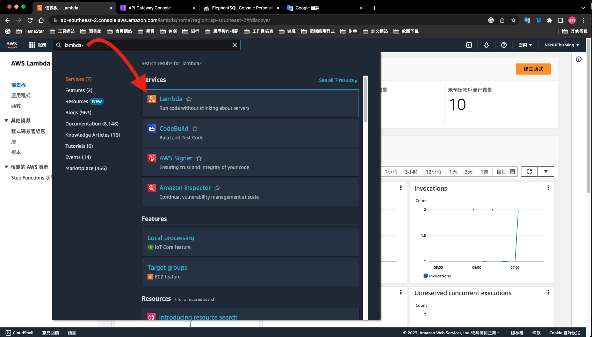

# Deploy

## 1. Login AWS

[Amazon Web Services Sign-In](https://signin.aws.amazon.com/signin?redirect_uri=https%3A%2F%2Fap-southeast-2.console.aws.amazon.com%2Flambda%3FhashArgs%3D%2523%26isauthcode%3Dtrue%26region%3Dap-southeast-2%26state%3DhashArgsFromTB_ap-southeast-2_f6888591dd0efc18&client_id=arn%3Aaws%3Asignin%3A%3A%3Aconsole%2Flambda&forceMobileApp=0&code_challenge=31k0-q-pwH01jEjk8WHrFF2I59zxuOfcMpxVWXYQ0Rs&code_challenge_method=SHA-256)

## 1. Deploy to AWS Lambda

### 1-1. 進入 Lambda 服務

### 1-2. 創建 Lambda 函數

### 1-3. 上傳程式碼

### 1-4. 編輯程式進入點

### 1-5. 測試

## 2. Deploy to AWS API Gateway

### 2-1. 進入 API Gateway 服務

### 2-2. 創建 API Gateway

### 2-3. 創建 API 路由

#### 2-3-1. 一般路由

#### 2-3-2. 帶參路由

### 2-4. 創建路由方法

